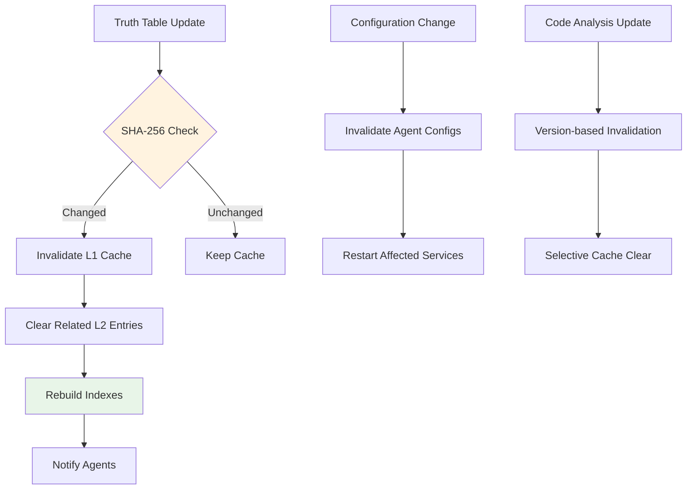
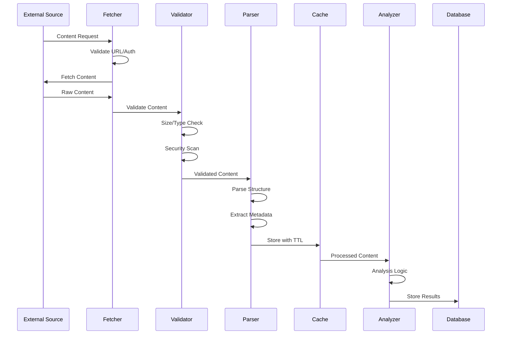

# TBCV Data Flow & Management

| **Title** | Data Flow & Management |
|---|---|
| **Version** | auto |
| **Source** | Database schema analysis @ 2025-11-03T07:43:18Z |

## Overview

TBCV implements a comprehensive data management strategy encompassing persistent storage, two-level caching, workflow state tracking, and external data integration. The system handles structured validation results, plugin truth data, and real-time workflow coordination through multiple data stores.

## Data Architecture

### Data Storage Layers

```mermaid
flowchart TD
    subgraph "External Data Sources"
        A1[GitHub Gists]
        A2[GitHub Repositories]
        A3[External URLs]
        A4[Local Files]
    end
    
    subgraph "Input Processing"
        B1[Content Parser]
        B2[Schema Validator]
        B3[Hash Generator]
    end
    
    subgraph "Caching Layer"
        C1[L1 Memory Cache]
        C2[L2 SQLite Cache]
    end
    
    subgraph "Primary Storage"
        D1[SQLite Database]
        D2[JSON Truth Files]
        D3[YAML Configuration]
    end
    
    subgraph "Output Formats"
        E1[JSON Reports]
        E2[CSV Exports]
        E3[Structured Logs]
        E4[WebSocket Events]
    end
    
    A1 --> B1
    A2 --> B1
    A3 --> B1
    A4 --> B1
    
    B1 --> B2
    B2 --> B3
    B3 --> C1
    
    C1 -.-> C2
    C2 --> D1
    
    B3 --> D2
    B2 --> D3
    
    D1 --> E1
    D1 --> E2
    D1 --> E3
    D1 --> E4
    
    style C1 fill:#e1f5fe
    style C2 fill:#e8f5e8
    style D1 fill:#f3e5f5
````

## Database Schema

### Core Tables

#### Workflows Table (`core/database.py:107-146`)

**Purpose:** Workflow state management and progress tracking

```sql
CREATE TABLE workflows (
    id VARCHAR(36) PRIMARY KEY,
    type VARCHAR(50) NOT NULL,
    state ENUM('pending','running','paused','completed','failed','cancelled'),
    input_params TEXT,  -- JSON
    created_at DATETIME,
    updated_at DATETIME,
    completed_at DATETIME,
    metadata TEXT,  -- JSON
    total_steps INTEGER DEFAULT 0,
    current_step INTEGER DEFAULT 0,
    progress_percent INTEGER DEFAULT 0,
    error_message TEXT
);
```

**Indexes**:

* `idx_workflows_state_created` on (`state`, `created_at`)
* `idx_workflows_type_state` on (`type`, `state`)

**Data Flow:** Created by OrchestratorAgent → Updated by background tasks → Queried by API/Dashboard

#### ValidationResult Table (`core/database.py:210-250`)

**Purpose:** Validation outcomes and quality metrics storage

```sql
CREATE TABLE validation_results (
    id VARCHAR(36) PRIMARY KEY,
    workflow_id VARCHAR(36) REFERENCES workflows(id),
    file_path VARCHAR(1024),
    rules_applied TEXT,  -- JSON
    validation_results TEXT,  -- JSON
    notes TEXT,
    severity VARCHAR(20),
    status ENUM('pass','fail','warning','skipped'),
    content_hash VARCHAR(64),
    ast_hash VARCHAR(64),
    run_id VARCHAR(64),
    created_at DATETIME,
    updated_at DATETIME
);
```

**Indexes**:

* `idx_validation_file_status` on (`file_path`, `status`)
* `idx_validation_file_severity` on (`file_path`, `severity`)
* `idx_validation_created` on (`created_at`)

**Data Flow:** Created by ContentValidatorAgent → Enhanced by ContentEnhancerAgent → Exported via API

#### Recommendation Table (`core/database.py:270-320`)

**Purpose:** Human-in-the-loop approval workflow

```sql
CREATE TABLE recommendations (
    id VARCHAR(36) PRIMARY KEY,
    validation_id VARCHAR(36) REFERENCES validation_results(id),
    recommendation_type VARCHAR(50),
    description TEXT,
    automated_fix TEXT,  -- JSON
    confidence_score FLOAT,
    status ENUM('pending','accepted','rejected','applied'),
    created_at DATETIME,
    reviewed_at DATETIME,
    reviewed_by VARCHAR(100),
    review_notes TEXT,
    applied_at DATETIME
);
```

**Data Flow:** Generated by agents → Reviewed by humans → Applied automatically or manually

#### Cache Tables

**CacheEntry Table** (`core/database.py:178-196`):

```sql
CREATE TABLE cache_entries (
    cache_key VARCHAR(200) PRIMARY KEY,
    agent_id VARCHAR(100),
    method_name VARCHAR(100),
    input_hash VARCHAR(64),
    result_data BLOB,
    created_at DATETIME,
    expires_at DATETIME,
    access_count INTEGER DEFAULT 1,
    last_accessed DATETIME,
    size_bytes INTEGER
);
```

**Checkpoints Table** (`core/database.py:149-175`):

```sql
CREATE TABLE checkpoints (
    id VARCHAR(36) PRIMARY KEY,
    workflow_id VARCHAR(36) REFERENCES workflows(id),
    name VARCHAR(100),
    step_number INTEGER,
    state_data BLOB,
    created_at DATETIME,
    validation_hash VARCHAR(32),
    can_resume_from BOOLEAN DEFAULT TRUE
);
```

### Data Lifecycle Management

#### Retention Policies

**Workflows**:

* Active workflows: Retained indefinitely
* Completed workflows: 90 days (configurable)
* Failed workflows: 30 days for debugging
* Cancelled workflows: 7 days

**Validation Results**:

* Current results: Retained indefinitely
* Historical results: 180 days with compression
* Associated files: Soft-delete with 30-day recovery

**Cache Data**:

* L1 Cache: Memory-based LRU eviction (1000 entries max)
* L2 Cache: 24-hour cleanup cycle, 1GB size limit
* Expired entries: Purged automatically

**Audit Logs**:

* System logs: 6 months
* Performance metrics: 1 year
* Error logs: 2 years

#### Backup Strategy

```yaml
# data/backup-strategy.yaml
backup:
  frequency: daily
  retention:
    daily: 7
    weekly: 4
    monthly: 12
  targets:
    - sqlite_database
    - json_truth_files
    - yaml_configuration
    - log_files
```

## Truth Data Management

### Plugin Truth Tables (`truth/words.json`)

**Schema Structure**:

```json
{
  "meta": {
    "version": "2.0.0",
    "family": "words",
    "generated_at": "2025-11-03T07:43:18Z",
    "total_plugins": 150,
    "schema_hash": "sha256:abc123..."
  },
  "plugins": {
    "word_plugin_001": {
      "id": "word_plugin_001",
      "name": "Document Converter",
      "family": "words",
      "patterns": {
        "format": ["doc_to_pdf", "convert_document"],
        "api": ["Converter.ConvertToPdf", "Document.Save"],
        "method": ["Convert()", "SaveAs()"]
      },
      "confidence_weights": {
        "exact_match": 1.0,
        "fuzzy_match": 0.8,
        "context_match": 0.6
      },
      "metadata": {
        "description": "Converts Word documents to various formats",
        "documentation_url": "https://products.aspose.com/words/net/plugins/converter/",
        "category": "conversion",
        "complexity": "medium"
      }
    }
  }
}
```

**Indexing Strategy** (`agents/truth_manager.py:117-686`):

* **B-tree Index:** O(log n) plugin lookups by ID
* **Pattern Index:** Hash-based pattern matching
* **Family Index:** Grouped by plugin family (words, cells, slides)
* **Cache Index:** Frequently accessed plugins in L1 cache

### Rule Combinations (`rules/words.json`)

**Schema Structure**:

```json
{
  "combination_rules": {
    "document_processing": {
      "plugins": ["word_plugin_001", "word_plugin_015"],
      "confidence_boost": 0.2,
      "context_required": ["Document", "Load", "Save"]
    }
  },
  "exclusion_rules": {
    "incompatible_pairs": [
      ["word_plugin_001", "word_plugin_099"]
    ]
  }
}
```

**Change Detection:** SHA-256 hashing for truth table versioning (`agents/truth_manager.py:121`)

## Caching Architecture

### Two-Level Cache Design (`core/cache.py`)

#### L1 Memory Cache

**Configuration** (`config/main.yaml:74-81`):

```yaml
cache:
  l1:
    enabled: true
    max_entries: 1000
    max_memory_mb: 256
    ttl_seconds: 3600
    cleanup_interval_seconds: 300
    eviction_policy: "LRU"
```

**Use Cases**:

* Plugin pattern lookups
* Frequently accessed validation results
* Configuration settings
* Agent state caching

#### L2 Persistent Cache

**Configuration** (`config/main.yaml:83-89`):

```yaml
cache:
  l2:
    enabled: true
    database_path: "./data/cache/tbcv_cache.db"
    max_size_mb: 1024
    cleanup_interval_hours: 24
    compression_enabled: true
    compression_threshold_bytes: 1024
```

**Use Cases**:

* External code analysis results
* Expensive fuzzy matching computations
* Document flow analysis
* Large validation datasets

### Cache Invalidation Strategy



## External Data Integration

### GitHub Integration (`agents/code_analyzer.py:247-1020`)

**Supported Sources**:

* GitHub Gists (public and authenticated)
* GitHub Repository files
* Direct file URLs
* Git repository cloning (limited)

**Data Flow**:

1. URL validation and parsing
2. Authentication header injection
3. Content fetching with retry logic
4. Virus scanning and size limits
5. Cache storage with TTL
6. Analysis and result storage

**Rate Limiting**:

```yaml
rate_limits:
  github_api: 5000/hour
  file_downloads: 100/hour
  max_file_size: 10MB
  concurrent_requests: 10
```

### Content Processing Pipeline



## Data Formats & Schemas

### Validation Result Schema

```json
{
  "$schema": "https://tbcv.schema.json/validation-result/v2.0",
  "validation_id": "val_abc123",
  "file_path": "./content/example.md",
  "timestamp": "2025-11-03T07:43:18.200Z",
  "content_hash": "sha256:def456...",
  "validation_results": {
    "yaml_validation": {
      "status": "pass",
      "issues": [],
      "confidence": 1.0
    },
    "content_validation": {
      "status": "warning",
      "issues": [
        {
          "line": 15,
          "column": 10,
          "level": "warning",
          "category": "style",
          "message": "Consider using consistent heading levels",
          "suggestion": "Change H4 to H3 for better hierarchy"
        }
      ],
      "confidence": 0.85
    },
    "plugin_detection": {
      "detected_plugins": [
        {
          "plugin_id": "word_plugin_001",
          "confidence": 0.92,
          "evidence": ["Document.Save", "SaveAs"],
          "line_numbers": [23, 45]
        }
      ],
      "fuzzy_matches": [
        {
          "pattern": "doc_converter",
          "matched_text": "document_convert",
          "algorithm": "levenshtein",
          "score": 0.87
        }
      ]
    }
  },
  "metrics": {
    "processing_time_ms": 245,
    "memory_usage_mb": 15.2,
    "cache_hits": 3,
    "cache_misses": 1
  },
  "recommendations": [
    {
      "id": "rec_001",
      "type": "plugin_linking",
      "description": "Add plugin link for Document Converter",
      "confidence": 0.92,
      "automated_fix": {
        "action": "insert_link",
        "position": 23,
        "content": "[Document Converter Plugin](https://products.aspose.com/words/net/plugins/converter/)"
      }
    }
  ]
}
```

### Enhancement Result Schema

```json
{
  "$schema": "https://tbcv.schema.json/enhancement-result/v2.0",
  "enhancement_id": "enh_xyz789",
  "source_validation_id": "val_abc123",
  "timestamp": "2025-11-03T07:43:20.150Z",
  "enhancements_applied": [
    {
      "type": "plugin_link_insertion",
      "position": {
        "line": 23,
        "column": 1
      },
      "original_content": "Document.Save(filename)",
      "enhanced_content": "[Document.Save](https://products.aspose.com/words/net/plugins/converter/) saves the document to the specified filename",
      "confidence": 0.92
    },
    {
      "type": "format_fix",
      "position": {
        "line": 45,
        "column": 1
      },
      "original_content": "#### Sub-heading",
      "enhanced_content": "### Sub-heading",
      "confidence": 1.0
    }
  ],
  "preview_mode": false,
  "metrics": {
    "total_enhancements": 2,
    "links_added": 1,
    "formats_fixed": 1,
    "processing_time_ms": 89
  }
}
```

## Data Quality & Monitoring

### Data Integrity Checks

* **Schema Validation:** Pydantic models enforce type safety (`api/server.py:64-100`)
* **Hash Verification:** Content integrity via SHA-256 hashing
* **Foreign Key Constraints:** Referential integrity in SQLite
* **Backup Verification:** Automated backup validation daily

### Performance Monitoring

**Metrics Collection** (`core/database.py:198-207`):

```sql
CREATE TABLE metrics (
    id VARCHAR(36) PRIMARY KEY,
    name VARCHAR(100),
    value FLOAT,
    created_at DATETIME,
    metadata TEXT -- JSON
);
```

**Key Performance Indicators**:

* Cache hit/miss ratios
* Database query response times
* Memory usage per workflow
* External API response times
* Validation throughput (files/minute)

### Data Privacy & Security

**Encryption**:

* Database: SQLite with encryption at rest (optional)
* Cache: Compression with optional encryption
* Logs: Structured JSON with PII scrubbing

**Access Control**:

* File system permissions (read-only truth tables)
* Database connection pooling with authentication
* API rate limiting per endpoint

**Data Sanitization**:

* Input validation for all external content
* HTML sanitization for markdown content
* Path traversal protection for file operations

---

For operational guidance, see:

* **[Operations Guide](operations.md)** — Monitoring and troubleshooting
* **[Runbook](runbook.md)** — Application startup and configuration
* **[Architecture](architecture.md)** — System component interactions