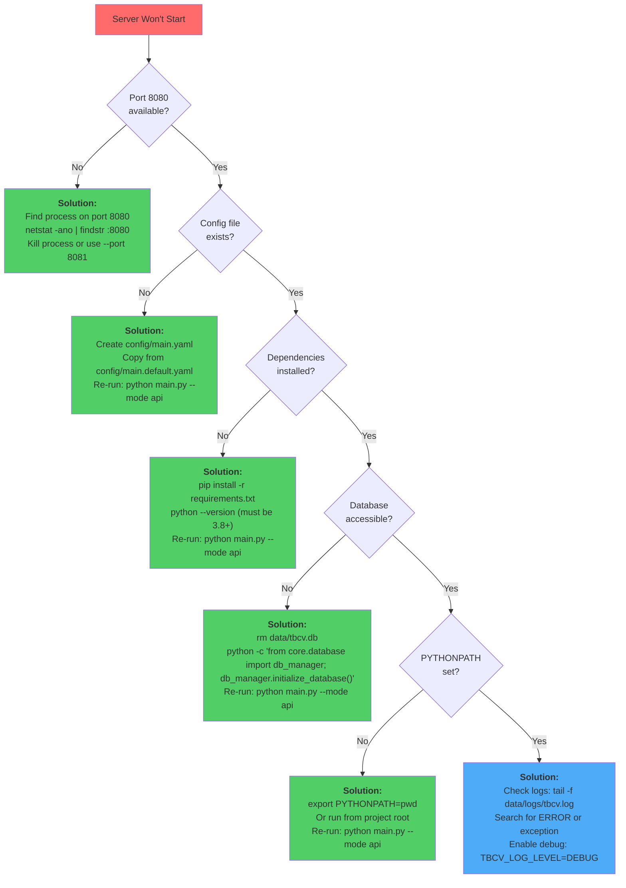
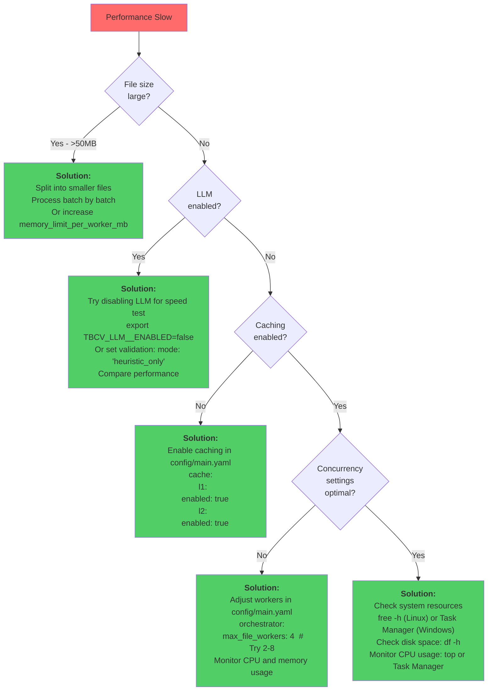
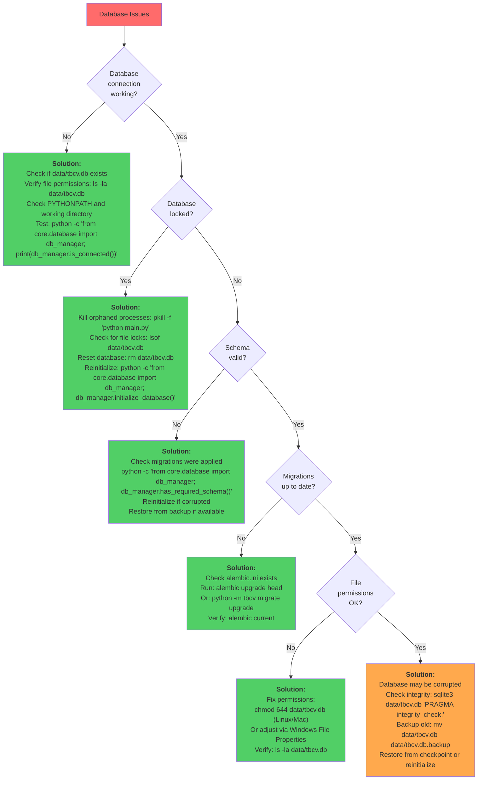
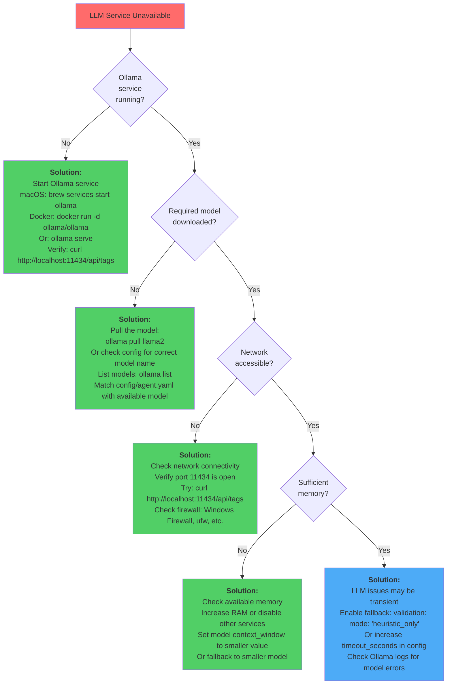
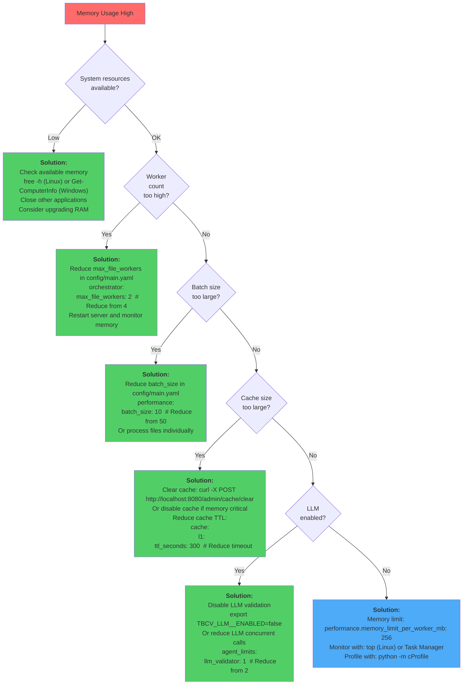
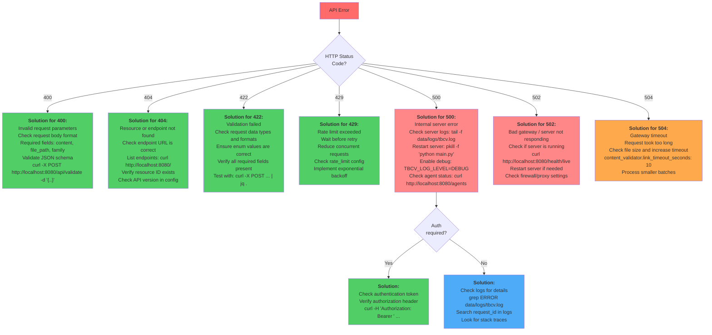
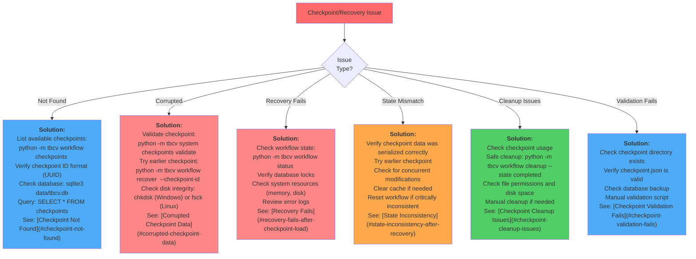

# TBCV Troubleshooting Guide

This guide helps resolve common issues when running TBCV.

## Quick Diagnostics

```bash
# Check server is running
curl http://localhost:8080/health/live

# Check all components are ready
curl http://localhost:8080/health/ready

# Check agents are registered
curl http://localhost:8080/agents

# View logs
tail -f data/logs/tbcv.log
```

## Common Issues

### 1. Server Won't Start

**Symptom**: `python main.py --mode api` fails

**Possible Causes & Solutions**:

#### Port Already in Use
```bash
# Check what's using port 8080
netstat -ano | findstr :8080   # Windows
lsof -i :8080                  # Linux/Mac

# Kill process or use different port
python main.py --mode api --port 8081
```

#### Database Lock
```bash
# Check database exists
ls -la data/tbcv.db

# Reset database
rm data/tbcv.db
python -c "from core.database import db_manager; db_manager.initialize_database()"
```

#### Missing Dependencies
```bash
# Reinstall requirements
pip install -r requirements.txt

# Check Python version (needs 3.8+)
python --version
```

#### Import Errors
```bash
# Check PYTHONPATH includes project root
export PYTHONPATH="${PYTHONPATH}:$(pwd)"

# Or run from project root
cd /path/to/tbcv
python main.py --mode api
```

### 2. Ollama/LLM Connection Issues

**Symptom**: LLM validation fails or timeouts

#### Ollama Not Running
```bash
# Check Ollama is accessible
curl http://localhost:11434/api/tags

# Start Ollama
ollama serve

# In another terminal, pull model
ollama pull llama2
```

#### Wrong Model Name
```yaml
# config/agent.yaml
llm_validator:
  model: llama2  # Must match installed model

# List installed models
ollama list
```

#### Timeout Issues
```yaml
# config/agent.yaml
llm_validator:
  timeout_seconds: 60  # Increase if slow
```

#### Disable LLM Validation
```yaml
# config/main.yaml
validation:
  mode: "heuristic_only"  # Skip LLM entirely
```

Or via environment variable:
```bash
export TBCV_LLM__ENABLED=false
python main.py --mode api
```

### 3. Database Errors

#### "Database is locked"
```bash
# Close all connections
pkill -f "python main.py"

# Check for orphaned processes
ps aux | grep tbcv

# Reset database
rm data/tbcv.db
python -c "from core.database import db_manager; db_manager.initialize_database()"
```

#### "No such table"
```bash
# Database schema not initialized
python -c "from core.database import db_manager; db_manager.initialize_database()"
```

#### Corrupted Database
```bash
# Backup old database
mv data/tbcv.db data/tbcv.db.backup

# Create fresh database
python -c "from core.database import db_manager; db_manager.initialize_database()"

# Note: This loses all validation history
```

### 4. Agent Not Responding

**Symptom**: Agent timeouts or "Agent not available"

#### Check Agent Status
```bash
curl http://localhost:8080/agents/<agent_id>
```

#### Agent Busy (Concurrency Limit)
```yaml
# config/main.yaml
orchestrator:
  retry_timeout_s: 300  # Increase timeout
  agent_limits:
    llm_validator: 2    # Allow more concurrent LLM calls
```

#### Agent Crashed
```bash
# Check logs for errors
tail -f data/logs/tbcv.log | grep agent_id

# Restart server
pkill -f "python main.py"
python main.py --mode api
```

#### Clear Agent Cache
```python
from agents.base import agent_registry
agent = agent_registry.get_agent("fuzzy_detector")
if agent:
    agent.clear_cache()
    print("Cache cleared")
```

### 5. Validation Failures

#### "Truth data not found"
```bash
# Check truth files exist
ls -la truth/*.json

# Check family name is correct
python -c "from agents.truth_manager import TruthManagerAgent; print(TruthManagerAgent('tm').get_supported_families())"
```

#### "No plugins detected"
```yaml
# Lower similarity threshold
# config/main.yaml
agents:
  fuzzy_detector:
    similarity_threshold: 0.7  # Default: 0.85
```

#### "Validation timeout"
```yaml
# Increase timeout
# config/main.yaml
content_validator:
  link_timeout_seconds: 10  # Default: 5
```

### 6. Enhancement Issues

#### "Safety gate: rewrite_ratio too high"
```yaml
# Increase threshold
# config/main.yaml
content_enhancer:
  rewrite_ratio_threshold: 0.7  # Default: 0.5 (50%)
```

#### "Recommendation not found"
```bash
# Check recommendation exists
curl http://localhost:8080/api/recommendations/<rec-id>

# Check status is "approved"
curl http://localhost:8080/api/recommendations?status=approved&validation_id=<val-id>
```

#### "No approved recommendations"
```bash
# Approve recommendations first
curl -X POST http://localhost:8080/api/recommendations/<rec-id>/review \
  -H "Content-Type: application/json" \
  -d '{"status": "accepted", "reviewer": "admin"}'
```

### 7. Performance Issues

#### Slow Validation
```yaml
# Enable caching
# config/main.yaml
cache:
  l1:
    enabled: true
  l2:
    enabled: true

# Reduce validation types
validation_types: ["yaml", "markdown"]  # Skip code, links, truth
```

#### High Memory Usage
```yaml
# Reduce workers
# config/main.yaml
orchestrator:
  max_file_workers: 2  # Default: 4

performance:
  memory_limit_per_worker_mb: 256
```

#### Disk Space Issues
```bash
# Clear old cache
rm -rf data/cache/*.db

# Clear old logs
find data/logs -name "*.log" -mtime +7 -delete

# Vacuum database
python -c "from core.database import db_manager; db_manager.vacuum()"
```

### 8. CLI Issues

#### "Command not found"
```bash
# Run as module
python -m cli.main validate-file file.md

# Or install as package
pip install -e .
tbcv validate-file file.md
```

#### "No module named 'cli'"
```bash
# Ensure PYTHONPATH is set
export PYTHONPATH="${PYTHONPATH}:$(pwd)"

# Or run from project root
cd /path/to/tbcv
python -m cli.main validate-file file.md
```

### 9. API Issues

#### "404 Not Found" on Valid Endpoint
```bash
# Check server is running on correct port
curl http://localhost:8080/health/live

# Check endpoint path is correct
curl http://localhost:8080/  # Lists all endpoints
```

#### "422 Unprocessable Entity"
```bash
# Check request body matches schema
curl -X POST http://localhost:8080/api/validate \
  -H "Content-Type: application/json" \
  -d '{
    "content": "...",
    "file_path": "test.md",
    "family": "words"
  }'

# Required fields: content, file_path, family
```

#### CORS Errors
```yaml
# config/main.yaml
server:
  enable_cors: true
  cors_origins:
    - "http://localhost:3000"
    - "https://your-domain.com"
```

### 10. WebSocket Issues

#### "WebSocket connection failed"
```bash
# Check WebSocket endpoint is correct
ws://localhost:8080/ws/<workflow_id>

# Not wss:// unless using HTTPS
```

#### "Connection timeout"
```yaml
# config/main.yaml
server:
  websocket_ping_interval: 60  # Default: 30
  websocket_ping_timeout: 20   # Default: 10
```

## Checkpoint and Recovery Issues

### Checkpoint Not Found

**Symptom**: Error message "Checkpoint not found: cp-xxx"

**Causes**:
- Checkpoint was deleted
- Incorrect checkpoint ID
- Database connection issue
- Checkpoint was never created

**Solutions**:

1. List all available checkpoints:
```bash
# For workflow checkpoints
python -m tbcv workflow checkpoints <workflow_id>

# API
curl http://localhost:8080/api/workflows/<workflow_id>/checkpoints
```

2. Verify checkpoint ID format (should be UUID):
```bash
# Example valid checkpoint ID: cp-a1b2c3d4-e5f6-7890-abcd-ef1234567890
```

3. Check database connectivity:
```bash
python -m tbcv system status
```

4. Try recovering from an earlier checkpoint:
```bash
python -m tbcv workflow recover <workflow_id> --checkpoint-id <earlier_cp_id>
```

5. Query database directly if needed:
```bash
sqlite3 data/tbcv.db "SELECT * FROM checkpoints WHERE workflow_id = '<workflow_id>';"
```

### Corrupted Checkpoint Data

**Symptom**: Error when loading checkpoint, "Failed to deserialize state data"

**Causes**:
- Disk corruption
- Serialization format mismatch
- Incomplete checkpoint write
- Manual database modification

**Solutions**:

1. Validate checkpoint integrity:
```python
from core.checkpoint_manager import CheckpointManager

checkpoint_mgr = CheckpointManager()
if not checkpoint_mgr.validate_checkpoint(checkpoint_id):
    print("Checkpoint is corrupted")
```

2. Try previous checkpoint:
```bash
# List checkpoints in reverse order
python -m tbcv workflow checkpoints <workflow_id>

# Recover from earlier checkpoint
python -m tbcv workflow recover <workflow_id> --checkpoint-id <earlier_cp_id>
```

3. Restore from system checkpoint:
```bash
# List system checkpoints
python -m tbcv system checkpoints list

# Recover entire system
python -m tbcv system checkpoints recover <system_cp_id>
```

4. Check disk integrity:
```bash
# Windows
chkdsk C: /F

# Linux
fsck /dev/sda1
```

5. If all checkpoints corrupted, restart workflow:
```bash
# Reset workflow state
python -m tbcv workflow reset <workflow_id>

# Start fresh
python -m tbcv workflow start <workflow_type> --params <params>
```

### Recovery Fails After Checkpoint Load

**Symptom**: Checkpoint loads successfully but workflow fails to resume

**Causes**:
- State inconsistency
- Missing dependencies
- Database lock
- Resource exhaustion

**Solutions**:

1. Check workflow state:
```bash
python -m tbcv workflow status <workflow_id>
```

2. Verify workflow is in correct state for recovery:
```python
# Should be FAILED or PAUSED
# Cannot recover from COMPLETED or CANCELLED
```

3. Check database locks:
```bash
# Check for database locks
sqlite3 data/tbcv.db ".databases"

# If locked, find processes
lsof data/tbcv.db  # Linux/Mac
```

4. Verify system resources:
```bash
# Check memory
free -h  # Linux
Get-ComputerInfo | Select-Object CsPhysicallyInstalledMemory  # Windows

# Check disk space
df -h  # Linux
Get-PSDrive  # Windows
```

5. Review error logs:
```bash
tail -100 data/logs/tbcv.log | grep -A 10 "recovery"
```

6. Manual state correction if needed:
```python
from core.database import DatabaseManager, WorkflowState

db = DatabaseManager()
db.update_workflow(
    workflow_id='<workflow_id>',
    state=WorkflowState.RUNNING,
    error_message=None
)
```

### State Inconsistency After Recovery

**Symptom**: Workflow resumes but state doesn't match expected values

**Causes**:
- Checkpoint created at wrong time
- Incomplete state serialization
- Concurrent modifications
- Cache inconsistency

**Solutions**:

1. Verify checkpoint data:
```python
import pickle
from core.database import DatabaseManager

db = DatabaseManager()
with db.get_session() as session:
    from core.database import Checkpoint
    checkpoint = session.query(Checkpoint).filter(
        Checkpoint.id == '<checkpoint_id>'
    ).first()

    # Inspect state data
    state = pickle.loads(checkpoint.state_data)
    print(state)
```

2. Rollback to earlier checkpoint:
```bash
python -m tbcv workflow rollback <workflow_id> --checkpoint-id <earlier_cp_id>
```

3. Check for concurrent modifications:
```bash
# List all workflows accessing same resources
python -m tbcv workflow list --state running
```

4. Clear cache if inconsistent:
```bash
python -m tbcv cache clear
```

5. Reset workflow if critically inconsistent:
```bash
python -m tbcv workflow reset <workflow_id>
```

### Checkpoint Validation Fails

**Symptom**: `validate_checkpoint()` returns False

**Causes**:
- Missing metadata file
- Invalid JSON in checkpoint
- Missing database backup
- Corrupted checkpoint directory

**Solutions**:

1. Check checkpoint directory exists:
```bash
ls -la .checkpoints/<checkpoint_id>/
```

2. Verify checkpoint.json file:
```bash
cat .checkpoints/<checkpoint_id>/checkpoint.json | python -m json.tool
```

3. Check required fields:
```bash
# Should contain: id, created_at, database_backed_up, cache_stats
jq 'keys' .checkpoints/<checkpoint_id>/checkpoint.json
```

4. Verify database backup:
```bash
ls -lh .checkpoints/<checkpoint_id>/database.db
```

5. Manual validation:
```python
from core.checkpoint_manager import CheckpointManager
import json

checkpoint_mgr = CheckpointManager()
try:
    info = checkpoint_mgr.get_checkpoint('<checkpoint_id>')
    print("Checkpoint info:", json.dumps(info, indent=2))
except Exception as e:
    print(f"Validation error: {e}")
```

### System Checkpoint Recovery Fails

**Symptom**: Cannot restore system from checkpoint

**Causes**:
- Active database connections
- Insufficient permissions
- Disk full
- Corrupted backup

**Solutions**:

1. Stop all TBCV processes:
```bash
# Find TBCV processes
ps aux | grep tbcv  # Linux/Mac
Get-Process | Where-Object {$_.ProcessName -like "*python*"}  # Windows

# Kill processes
pkill -f "python.*tbcv"  # Linux/Mac
Stop-Process -Name python  # Windows
```

2. Check file permissions:
```bash
ls -la data/tbcv.db
chmod 644 data/tbcv.db  # If needed
```

3. Check disk space:
```bash
df -h data/  # Linux/Mac
Get-PSDrive C  # Windows
```

4. Verify backup integrity:
```bash
sqlite3 .checkpoints/<checkpoint_id>/database.db "PRAGMA integrity_check;"
```

5. Manual database restore:
```bash
# Backup current database
cp data/tbcv.db data/tbcv.db.backup

# Restore from checkpoint
cp .checkpoints/<checkpoint_id>/database.db data/tbcv.db

# Verify
sqlite3 data/tbcv.db "SELECT COUNT(*) FROM workflows;"
```

### Checkpoint Cleanup Issues

**Symptom**: Cannot delete old checkpoints, disk space grows

**Causes**:
- File permission issues
- Database locks
- Active workflows referencing checkpoints
- Filesystem errors

**Solutions**:

1. Check checkpoint usage:
```bash
# Find checkpoints still in use
python -c "
from core.database import DatabaseManager
db = DatabaseManager()
with db.get_session() as session:
    from core.database import Checkpoint, Workflow
    active = session.query(Checkpoint).join(Workflow).filter(
        Workflow.state.in_(['RUNNING', 'PAUSED'])
    ).all()
    for cp in active:
        print(f'Active: {cp.id} (Workflow: {cp.workflow_id})')
"
```

2. Safe cleanup of completed workflows:
```bash
python -m tbcv workflow cleanup --state completed --keep-last 3
```

3. Force cleanup (use with caution):
```python
from core.database import DatabaseManager

db = DatabaseManager()
with db.get_session() as session:
    from core.database import Checkpoint, Workflow
    # Delete checkpoints for completed workflows older than 30 days
    from datetime import datetime, timedelta, timezone
    cutoff = datetime.now(timezone.utc) - timedelta(days=30)

    old_checkpoints = session.query(Checkpoint).join(Workflow).filter(
        Workflow.state == 'COMPLETED',
        Checkpoint.created_at < cutoff
    ).all()

    for cp in old_checkpoints:
        session.delete(cp)
    session.commit()
    print(f"Deleted {len(old_checkpoints)} old checkpoints")
```

4. Check filesystem:
```bash
# Find large checkpoint files
find .checkpoints -type f -size +100M -ls

# Check total checkpoint space
du -sh .checkpoints
```

5. Manual cleanup:
```bash
# Remove specific checkpoint
rm -rf .checkpoints/<checkpoint_id>

# Clean up database references
sqlite3 data/tbcv.db "DELETE FROM checkpoints WHERE id = '<checkpoint_id>';"
```

### Recovery Best Practices

To avoid recovery issues:

1. **Regular Validation**:
```bash
# Weekly checkpoint validation
python -m tbcv system checkpoints validate --all
```

2. **Automated Cleanup**:
```yaml
# config/main.yaml
checkpoints:
  retention:
    keep_completed: 3
    keep_failed: 10
    max_age_days: 30
    auto_cleanup: true
```

3. **Monitor Checkpoint Health**:
```bash
# Check checkpoint statistics
python -m tbcv system checkpoints stats
```

4. **Test Recovery Periodically**:
```bash
# Run recovery tests
pytest tests/workflows/test_checkpoint_recovery.py -v
```

5. **Backup Before Major Operations**:
```bash
# Create system checkpoint before upgrades
python -m tbcv system checkpoints create --name "pre_upgrade_$(date +%Y%m%d)"
```

For detailed recovery procedures, see:
- [Workflow Recovery Guide](workflow_recovery.md) - Complete recovery documentation
- [Workflows Guide](workflows.md) - Checkpoint and recovery section

## Debug Mode

Enable debug logging:

```bash
# Via environment variable
export TBCV_LOG_LEVEL=DEBUG
python main.py --mode api

# Via config
# config/main.yaml
system:
  debug: true
  log_level: "debug"
```

View debug logs:
```bash
tail -f data/logs/tbcv.log | grep DEBUG
```

## Health Checks

### System Health
```bash
curl http://localhost:8080/health

# Returns:
# {
#   "status": "healthy",
#   "database_connected": true,
#   "schema_present": true,
#   "agents_registered": 8,
#   "version": "2.0.0"
# }
```

### Readiness Check
```bash
curl http://localhost:8080/health/ready

# Returns:
# {
#   "status": "ready",
#   "checks": {
#     "database": true,
#     "schema": true,
#     "agents": true
#   }
# }
```

### Liveness Check
```bash
curl http://localhost:8080/health/live

# Returns:
# {
#   "status": "alive",
#   "timestamp": "2024-01-15T10:00:00Z"
# }
```

## Log Analysis

### Find Errors
```bash
grep ERROR data/logs/tbcv.log | tail -20
```

### Find Agent Issues
```bash
grep "agent_id.*error" data/logs/tbcv.log
```

### Track Request
```bash
grep "request_id=<id>" data/logs/tbcv.log
```

### Performance Analysis
```bash
grep "response_time_ms" data/logs/tbcv.log | \
  awk '{sum+=$NF; count++} END {print "Avg:", sum/count, "ms"}'
```

## Configuration Validation

Check configuration is valid:

```python
from core.config import get_settings

try:
    settings = get_settings()
    print("Configuration valid!")
    print(f"Environment: {settings.system.environment}")
    print(f"Debug: {settings.system.debug}")
    print(f"LLM enabled: {settings.llm.enabled}")
except Exception as e:
    print(f"Configuration error: {e}")
```

## Testing Connectivity

### Test Database
```python
from core.database import db_manager

print(f"Connected: {db_manager.is_connected()}")
print(f"Schema present: {db_manager.has_required_schema()}")
```

### Test Truth Data
```python
from agents.base import agent_registry
truth_mgr = agent_registry.get_agent("truth_manager")
if truth_mgr:
    result = await truth_mgr.process_request("load_truth_data", {"family": "words"})
    print(f"Loaded {result['plugins_count']} plugins")
```

### Test Ollama
```bash
curl -X POST http://localhost:11434/api/generate \
  -d '{
    "model": "llama2",
    "prompt": "Say hello",
    "stream": false
  }'
```

## Reset Everything

Nuclear option - reset entire system:

```bash
#!/bin/bash
# WARNING: This deletes all data!

# Stop server
pkill -f "python main.py"

# Delete all data
rm -rf data/

# Recreate directories
mkdir -p data/logs data/cache data/temp

# Reinitialize database
python -c "from core.database import db_manager; db_manager.initialize_database()"

# Restart server
python main.py --mode api
```

## Getting Help

1. **Check logs**: `data/logs/tbcv.log`
2. **Check configuration**: Verify `config/main.yaml` and `config/agent.yaml`
3. **Test components**: Use health endpoints and individual agent tests
4. **Enable debug**: Set `TBCV_LOG_LEVEL=DEBUG`
5. **Search issues**: Check GitHub issues for similar problems
6. **Ask for help**: Open new GitHub issue with logs and error details

## Useful Commands Reference

```bash
# Check system status
curl http://localhost:8080/health

# List all agents
curl http://localhost:8080/agents

# View workflow status
curl http://localhost:8080/workflows/<workflow-id>

# List validations
curl http://localhost:8080/api/validations?limit=10

# List recommendations
curl http://localhost:8080/api/recommendations?status=proposed

# Clear cache
curl -X POST http://localhost:8080/admin/cache/clear

# View metrics
curl http://localhost:8080/metrics
```

### 11. Error Handling Issues

**Symptom**: Error responses not properly formatted or missing information

#### Understanding the 3-Layer Error System

TBCV uses a sophisticated 3-layer error handling architecture. See [Error Handling Architecture](architecture.md#error-handling-architecture) for complete details.

**Quick Overview:**
```
Layer 1: MCP Errors (Domain) → Layer 2: HTTP Handlers (Transport) → Layer 3: Formatters (Presentation)
```

#### Error Response Missing Data

**Problem**: API returns error but missing expected fields

```bash
# Check error response format
curl -X POST http://localhost:8080/api/validate \
  -H "Content-Type: application/json" \
  -d '{"invalid": "data"}' | jq .
```

**Expected Fields:**
- `error`: Error message
- `type`: Error class name
- `code`: JSON-RPC error code (for MCP errors)
- `data`: Additional error data
- `meta`: Request metadata (path, method, timestamp)

**Solution:**
```python
# Ensure error handlers are registered
from api.error_handlers import register_error_handlers

app = FastAPI()
register_error_handlers(app)  # Must be called during startup
```

#### Unicode Encoding Errors in Logs

**Symptom**: Errors logged as "(encoding issue)" instead of actual message

**Cause**: Content contains non-ASCII characters that Windows console can't display

**Solution 1**: Set UTF-8 encoding for console
```bash
# Windows PowerShell
$OutputEncoding = [Console]::OutputEncoding = [Text.Encoding]::UTF8
chcp 65001

# Windows Command Prompt
chcp 65001

# Environment variable (persistent)
set PYTHONIOENCODING=utf-8
```

**Solution 2**: Disable colorized output
```python
# CLI
output = ErrorFormatter.to_cli(issues, colorized=False)

# Or via environment variable
export TBCV_CLI_COLORIZED=false
```

#### Missing Error Codes

**Problem**: MCP error returned without JSON-RPC error code

**Verification:**
```python
from svc.mcp_exceptions import MCPValidationError

# Correct - includes error code
raise MCPValidationError("Validation failed", code=-32000)

# Incorrect - missing error code
raise MCPValidationError("Validation failed")  # code will be None
```

**Standard Error Codes:**
- `-32601` - Method not found (MCPMethodNotFoundError)
- `-32602` - Invalid params (MCPInvalidParamsError)
- `-32603` - Internal error (MCPInternalError)
- `-32000` - Validation failed (MCPValidationError)
- `-32001` - Resource not found (MCPResourceNotFoundError)

#### Wrong HTTP Status Code

**Problem**: Error returns HTTP 500 instead of more specific status code

**Verification:**
```bash
# Check status code mapping
curl -i -X POST http://localhost:8080/api/validate \
  -H "Content-Type: application/json" \
  -d '{"content": "", "file_path": "test.md"}'
```

**Expected Mappings:**
| MCP Error | HTTP Status | When to Use |
|-----------|-------------|-------------|
| MCPValidationError | 422 | Content validation failed |
| MCPResourceNotFoundError | 404 | Resource not found |
| MCPInvalidParamsError | 400 | Invalid request parameters |
| MCPMethodNotFoundError | 501 | Method doesn't exist |
| MCPTimeoutError | 504 | Request timed out |
| MCPInternalError | 500 | Server error |

**Fix**: Use specific MCP error types in agent code
```python
# Good - specific error type
raise MCPResourceNotFoundError("Validation not found", code=-32001)

# Bad - generic error type
raise MCPError("Not found")  # Returns 500 instead of 404
```

#### Error Handlers Not Being Invoked

**Symptom**: Errors not caught by custom handlers

**Verification:**
```python
# Check handlers are registered
import api.server as server
print(server.app.exception_handlers)  # Should show MCPError, ValidationError, Exception
```

**Solution:**
```python
# Ensure registration happens after app creation
from fastapi import FastAPI
from api.error_handlers import register_error_handlers

app = FastAPI()
register_error_handlers(app)  # Must be called!

# Don't define handlers again - use register_error_handlers()
```

#### CLI Not Showing Colorized Output

**Problem**: CLI shows color codes as raw text

**Cause**: Terminal doesn't support ANSI colors

**Solution:**
```bash
# Windows: Use Windows Terminal or enable ANSI support
# Check if colors are supported
python -c "from core.error_formatter import Colors; print(f'{Colors.ERROR}Test{Colors.RESET}')"

# Disable colors if needed
export TBCV_CLI_COLORIZED=false
# Or use --no-color flag
tbcv validate-file test.md --no-color
```

#### Error Formatter Returns Empty String

**Problem**: `ErrorFormatter.to_cli()` returns empty or "No issues found"

**Verification:**
```python
from core.error_formatter import ErrorFormatter
from agents.validators.base_validator import ValidationIssue

issues = [
    ValidationIssue(
        level="error",
        category="yaml",
        message="Test error",
        line_number=1
    )
]

output = ErrorFormatter.to_cli(issues)
print(output)  # Should show formatted output
```

**Common Causes:**
- Empty issues list passed to formatter
- Issues have invalid severity levels
- Formatter called with max_issues=0

#### Debugging Error Handling

**Enable Debug Logging:**
```bash
export TBCV_LOG_LEVEL=DEBUG
python main.py --mode api
```

**Check Error Handler Logs:**
```bash
# Search for error handler invocations
grep "error_handlers" data/logs/tbcv.log

# Search for specific error types
grep "MCPValidationError" data/logs/tbcv.log
```

**Test Error Handling:**
```python
# Test MCP exception to HTTP conversion
from svc.mcp_exceptions import MCPValidationError
from api.mcp_helpers import mcp_error_to_http_exception

exc = MCPValidationError("Test error", code=-32000)
http_exc = mcp_error_to_http_exception(exc)
print(f"Status: {http_exc.status_code}")  # Should be 422
print(f"Detail: {http_exc.detail}")
```

**Test Error Formatters:**
```python
# Test all output formats
from core.error_formatter import ErrorFormatter

# CLI format
cli_output = ErrorFormatter.to_cli(issues, colorized=False)
print("CLI:", cli_output)

# JSON format
json_output = ErrorFormatter.to_json(issues)
print("JSON:", json_output)

# HTML format
html_output = ErrorFormatter.to_html_context(issues)
print("HTML:", html_output)

# Log format
log_output = ErrorFormatter.format_for_log(issues)
print("LOG:", log_output)
```

#### Related Documentation

- [Error Handling Architecture](architecture.md#error-handling-architecture) - Complete 3-layer error system
- [API Reference - Error Handling](api_reference.md#error-handling) - HTTP error responses
- [MCP Exceptions](architecture.md#layer-1-mcp-errors-domain-layer) - Domain error types

## Troubleshooting Flowcharts

The following interactive flowcharts guide you through common troubleshooting scenarios with decision trees and clear resolution paths.

### 1. Server Won't Start Flowchart



**Related Solutions**: [Port Already in Use](#port-already-in-use) | [Missing Dependencies](#missing-dependencies) | [Database Lock](#database-lock) | [Import Errors](#import-errors)

---

### 2. Validation Failing Flowchart

```mermaid
flowchart TD
    Start[Validation Failing] --> Format{File format<br/>valid?}
    Format -->|No| CheckFormat["<b>Solution:</b><br/>Verify file extension: .md, .yaml, .yml<br/>Check file encoding: UTF-8<br/>Validate YAML/Markdown syntax<br/>Try: python -c 'import yaml; yaml.safe_load(open(file))'"]
    Format -->|Yes| Truth{Truth data<br/>loaded?}
    Truth -->|No| LoadTruth["<b>Solution:</b><br/>Check family name is correct<br/>Verify truth/*.json files exist<br/>Run: python -c 'from agents.truth_manager import TruthManagerAgent; print(TruthManagerAgent(\"tm\").get_supported_families())'"]
    Truth -->|Yes| Feature{Feature flags<br/>enabled?}
    Feature -->|No| CheckFeature["<b>Solution:</b><br/>Check validation mode in config/main.yaml<br/>validation_types: ['yaml', 'markdown', 'links', 'truth', 'code']<br/>Or use TBCV_VALIDATION__MODE=<mode>"]
    Feature -->|Yes| Agent{Agent<br/>available?}
    Agent -->|No| CheckAgent["<b>Solution:</b><br/>Check agent status: curl http://localhost:8080/agents<br/>Restart agent if needed<br/>Check agent logs in data/logs/tbcv.log"]
    Agent -->|Yes| Threshold{Similarity<br/>threshold<br/>too high?}
    Threshold -->|Yes| LowerThreshold["<b>Solution:</b><br/>Lower threshold in config/main.yaml<br/>agents:<br/>  fuzzy_detector:<br/>    similarity_threshold: 0.7  # Default: 0.85<br/>Increase detection sensitivity"]
    Threshold -->|No| Timeout["<b>Solution:</b><br/>Increase timeout: content_validator.link_timeout_seconds: 10<br/>Check network connectivity<br/>Enable LLM validation if disabled"]
    style Start fill:#ff6b6b
    style CheckFormat fill:#51cf66
    style LoadTruth fill:#51cf66
    style CheckFeature fill:#51cf66
    style CheckAgent fill:#51cf66
    style LowerThreshold fill:#51cf66
    style Timeout fill:#51cf66
```

**Related Solutions**: [Truth Data Not Found](#truth-data-not-found) | [No Plugins Detected](#no-plugins-detected) | [Validation Timeout](#validation-timeout) | [Lower Similarity Threshold](#lower-similarity-threshold)

---

### 3. Slow Performance Flowchart



**Related Solutions**: [Slow Validation](#slow-validation) | [High Memory Usage](#high-memory-usage) | [Enable Caching](#enable-caching) | [Concurrency Settings](#concurrency-settings)

---

### 4. Database Issues Flowchart



**Related Solutions**: [Database Lock](#database-locked) | [No Such Table](#no-such-table) | [Corrupted Database](#corrupted-database) | [System Checkpoint Recovery](#system-checkpoint-recovery-fails)

---

### 5. LLM Service Unavailable Flowchart



**Related Solutions**: [Ollama Not Running](#ollama-not-running) | [Wrong Model Name](#wrong-model-name) | [Timeout Issues](#timeout-issues) | [Disable LLM Validation](#disable-llm-validation)

---

### 6. Memory Issues Flowchart



**Related Solutions**: [High Memory Usage](#high-memory-usage) | [Reduce Workers](#reduce-workers) | [Cache Configuration](#cache-configuration) | [System Resources](#verify-system-resources)

---

### 7. API Errors Flowchart



**Related Solutions**: [404 Not Found](#404-not-found-on-valid-endpoint) | [422 Unprocessable Entity](#422-unprocessable-entity) | [CORS Errors](#cors-errors) | [API Issues](#api-issues)

---

### 8. Checkpoint and Recovery Issues Flowchart



**Related Solutions**: [Checkpoint Not Found](#checkpoint-not-found) | [Corrupted Checkpoint Data](#corrupted-checkpoint-data) | [Recovery Best Practices](#recovery-best-practices) | [System Checkpoint Recovery](#system-checkpoint-recovery-fails)

---

## When All Else Fails

1. Check Python version: `python --version` (must be 3.8+)
2. Check dependencies: `pip list | grep -E "(fastapi|uvicorn|sqlalchemy|pydantic)"`
3. Check file permissions: `ls -la data/`
4. Check disk space: `df -h`
5. Check memory: `free -m` (Linux) or Task Manager (Windows)
6. Restart everything: Stop server, delete `data/`, reinitialize, restart

If problem persists, open a GitHub issue with:
- Error message from logs
- Configuration files (sanitized)
- Python version and OS
- Steps to reproduce
