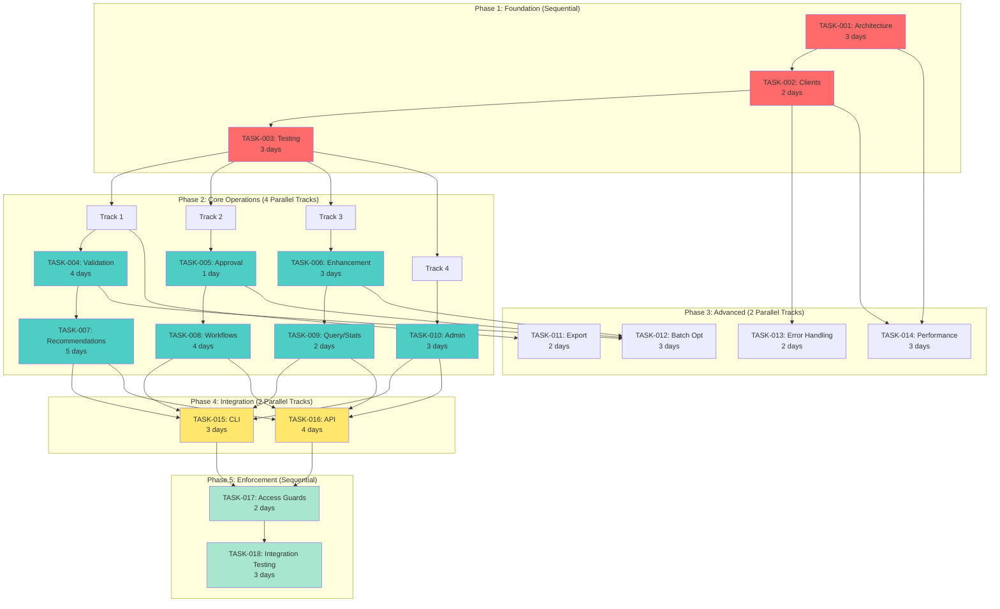

# Autonomous Execution Plan: MCP-First Architecture Migration

**Created**: 2025-11-30
**Status**: Ready for Autonomous Execution
**Execution Mode**: Parallel Agent Coordination
**Total Duration**: 9 weeks (can be reduced to 6 weeks with full parallelization)

---

## 🤖 Execution Strategy

This plan coordinates multiple autonomous agents working in parallel to complete all 18 tasks systematically. Each agent is assigned specific tasks based on dependencies and can work independently once prerequisites are met.

### Parallel Execution Principles

1. **Maximum Parallelization**: Run all independent tasks simultaneously
2. **Dependency Management**: Wait for prerequisites before starting dependent tasks
3. **Validation Gates**: Each phase must pass validation before next phase starts
4. **Continuous Integration**: Tests run continuously as code is committed
5. **Autonomous Coordination**: Agents self-organize based on dependency graph

---

## 📊 Dependency Graph & Parallel Tracks



---

## 🎯 Agent Assignment & Coordination

### Agent Pool

| Agent ID | Specialization | Primary Tasks | Backup Tasks |
|----------|---------------|---------------|--------------|
| **AGENT-ARCH** | Architecture & Infrastructure | TASK-001, TASK-002, TASK-003 | TASK-014, TASK-017 |
| **AGENT-VAL** | Validation & Recommendations | TASK-004, TASK-007 | TASK-009 |
| **AGENT-WF** | Workflows & Approval | TASK-005, TASK-008 | TASK-010 |
| **AGENT-ENH** | Enhancement & Optimization | TASK-006, TASK-012 | TASK-011 |
| **AGENT-ADM** | Admin & Monitoring | TASK-009, TASK-010, TASK-014 | TASK-013 |
| **AGENT-CLI** | CLI Integration | TASK-015 | TASK-013 |
| **AGENT-API** | API Integration | TASK-016 | TASK-011 |
| **AGENT-QA** | Testing & Validation | TASK-003, TASK-018 | All testing |

---

## 📅 Execution Timeline with Parallel Coordination

### Week 1: Foundation (Sequential) 🔴

**Days 1-3: TASK-001 (Architecture)**

**Agent**: AGENT-ARCH
**Dependencies**: None
**Parallel Work**: None (critical path)

```bash
# Autonomous execution commands
git checkout -b auto/task-001-architecture

# Create directory structure
mkdir -p svc/mcp_methods
touch svc/mcp_methods/{__init__.py,base.py,utils.py,validation_methods.py,approval_methods.py,enhancement_methods.py}

# Implement from IMPLEMENTATION_ROADMAP.md
# - svc/mcp_methods/base.py (BaseMCPMethod, MCPMethodRegistry)
# - svc/mcp_methods/utils.py (JSON-RPC utilities)
# - Migrate existing 4 methods to new structure

# Run tests
pytest tests/svc/test_mcp_server_architecture.py -v --cov=svc.mcp_methods

# Commit and merge
git add svc/mcp_methods/ svc/mcp_server.py
git commit -m "feat(mcp): implement modular architecture (TASK-001)"
git push origin auto/task-001-architecture

# Create PR and auto-merge if tests pass
gh pr create --title "feat(mcp): MCP Server Architecture (TASK-001)" --body "$(cat plans/tasks/TASK-001.md)" --base main
gh pr merge --auto --squash
```

**Success Criteria**:
- [ ] MCPMethodRegistry implemented
- [ ] BaseMCPMethod base class created
- [ ] 4 existing methods migrated
- [ ] Tests passing (>90% coverage)
- [ ] PR merged to main

**Days 4-5: TASK-002 (Clients)**

**Agent**: AGENT-ARCH
**Dependencies**: TASK-001 ✅
**Parallel Work**: None

```bash
git checkout main && git pull
git checkout -b auto/task-002-clients

# Create files
touch svc/{mcp_client.py,mcp_exceptions.py}

# Implement from IMPLEMENTATION_ROADMAP.md
# - svc/mcp_exceptions.py (Exception hierarchy)
# - svc/mcp_client.py (MCPSyncClient, MCPAsyncClient)

# Run tests
pytest tests/svc/test_mcp_client.py -v
pytest tests/svc/test_mcp_exceptions.py -v

# Type checking
mypy svc/mcp_client.py svc/mcp_exceptions.py

# Commit and merge
git add svc/mcp_client.py svc/mcp_exceptions.py
git commit -m "feat(mcp): implement sync/async clients (TASK-002)"
git push origin auto/task-002-clients
gh pr create --title "feat(mcp): MCP Client Wrappers (TASK-002)" --auto-merge
```

**Success Criteria**:
- [ ] MCPSyncClient implemented
- [ ] MCPAsyncClient implemented
- [ ] Exception hierarchy complete
- [ ] Tests passing (>90% coverage)
- [ ] PR merged to main

**Days 6-8: TASK-003 (Testing Infrastructure)**

**Agent**: AGENT-QA
**Dependencies**: TASK-001 ✅, TASK-002 ✅
**Parallel Work**: None

```bash
git checkout main && git pull
git checkout -b auto/task-003-testing

# Create test infrastructure
mkdir -p tests/svc tests/integration
touch tests/svc/{conftest.py,test_mcp_comprehensive.py}
touch tests/integration/test_mcp_end_to_end.py

# Implement from IMPLEMENTATION_ROADMAP.md
# - Test fixtures
# - Comprehensive test cases
# - Integration tests

# Run all tests
pytest tests/ -v --cov=svc --cov-report=html

# Commit and merge
git add tests/
git commit -m "test(mcp): add comprehensive test infrastructure (TASK-003)"
git push origin auto/task-003-testing
gh pr create --title "test(mcp): Testing Infrastructure (TASK-003)" --auto-merge
```

**Success Criteria**:
- [ ] Test fixtures created
- [ ] Comprehensive tests added
- [ ] All tests passing
- [ ] Coverage >90%
- [ ] PR merged to main

**🚧 PHASE 1 GATE**: All foundation tasks complete, tests passing

---

### Week 2-4: Core Operations (4 Parallel Tracks) 🔵

**Parallel Execution**: 4 agents working simultaneously

#### Track 1: Validation & Recommendations

**Agent**: AGENT-VAL
**Duration**: 9 days (4 + 5)

**TASK-004 (Days 1-4): Validation Methods**

```bash
git checkout main && git pull
git checkout -b auto/task-004-validation

# Implement 8 methods in svc/mcp_methods/validation_methods.py
# Code provided in IMPLEMENTATION_ROADMAP.md:
# - validate_file
# - validate_content
# - get_validation
# - list_validations
# - update_validation
# - delete_validation
# - revalidate

# Update MCPServer registration
# Update MCPSyncClient and MCPAsyncClient

# Create tests
touch tests/svc/test_mcp_validation_methods.py

# Run tests
pytest tests/svc/test_mcp_validation_methods.py -v

# Commit and merge
git add svc/mcp_methods/validation_methods.py svc/mcp_server.py svc/mcp_client.py tests/
git commit -m "feat(mcp): implement 8 validation methods (TASK-004)"
git push origin auto/task-004-validation
gh pr create --title "feat(mcp): Validation Methods (TASK-004)" --auto-merge
```

**TASK-007 (Days 5-9): Recommendation Methods**

```bash
git checkout main && git pull
git checkout -b auto/task-007-recommendations

# Create recommendation methods module
touch svc/mcp_methods/recommendation_methods.py

# Implement 8 methods:
# - generate_recommendations
# - rebuild_recommendations
# - get_recommendations
# - review_recommendation
# - bulk_review_recommendations
# - apply_recommendations
# - delete_recommendation
# - mark_recommendations_applied

# Update registrations and clients
# Create tests

pytest tests/svc/test_mcp_recommendation_methods.py -v

git add svc/mcp_methods/recommendation_methods.py svc/mcp_server.py svc/mcp_client.py tests/
git commit -m "feat(mcp): implement 8 recommendation methods (TASK-007)"
git push origin auto/task-007-recommendations
gh pr create --title "feat(mcp): Recommendation Methods (TASK-007)" --auto-merge
```

#### Track 2: Approval & Workflows

**Agent**: AGENT-WF
**Duration**: 5 days (1 + 4)

**TASK-005 (Day 1): Approval Methods**

```bash
git checkout main && git pull
git checkout -b auto/task-005-approval

# Add to svc/mcp_methods/approval_methods.py:
# - bulk_approve
# - bulk_reject

# Tests
pytest tests/svc/test_mcp_approval_methods.py -v

git commit -m "feat(mcp): implement bulk approval methods (TASK-005)"
git push origin auto/task-005-approval
gh pr create --title "feat(mcp): Approval Methods (TASK-005)" --auto-merge
```

**TASK-008 (Days 2-5): Workflow Methods**

```bash
git checkout main && git pull
git checkout -b auto/task-008-workflows

# Create workflow methods module
touch svc/mcp_methods/workflow_methods.py

# Implement 8 methods:
# - create_workflow
# - get_workflow
# - list_workflows
# - control_workflow
# - get_workflow_report
# - get_workflow_summary
# - delete_workflow
# - bulk_delete_workflows

pytest tests/svc/test_mcp_workflow_methods.py -v

git commit -m "feat(mcp): implement 8 workflow methods (TASK-008)"
git push origin auto/task-008-workflows
gh pr create --title "feat(mcp): Workflow Methods (TASK-008)" --auto-merge
```

#### Track 3: Enhancement & Query

**Agent**: AGENT-ENH
**Duration**: 5 days (3 + 2)

**TASK-006 (Days 1-3): Enhancement Methods**

```bash
git checkout main && git pull
git checkout -b auto/task-006-enhancement

# Add to svc/mcp_methods/enhancement_methods.py:
# - enhance_batch
# - enhance_preview
# - enhance_auto_apply
# - get_enhancement_comparison

pytest tests/svc/test_mcp_enhancement_methods.py -v

git commit -m "feat(mcp): implement 4 enhancement methods (TASK-006)"
git push origin auto/task-006-enhancement
gh pr create --title "feat(mcp): Enhancement Methods (TASK-006)" --auto-merge
```

**TASK-009 (Days 4-5): Query/Stats Methods**

```bash
git checkout main && git pull
git checkout -b auto/task-009-query

# Create query/stats methods module
touch svc/mcp_methods/query_methods.py

# Implement 6 methods:
# - get_stats
# - get_audit_log
# - get_performance_report
# - get_health_report
# - get_validation_history
# - get_available_validators

pytest tests/svc/test_mcp_query_methods.py -v

git commit -m "feat(mcp): implement 6 query/stats methods (TASK-009)"
git push origin auto/task-009-query
gh pr create --title "feat(mcp): Query/Stats Methods (TASK-009)" --auto-merge
```

#### Track 4: Admin

**Agent**: AGENT-ADM
**Duration**: 3 days

**TASK-010 (Days 1-3): Admin/Maintenance Methods**

```bash
git checkout main && git pull
git checkout -b auto/task-010-admin

# Create admin methods module
touch svc/mcp_methods/admin_methods.py

# Implement 10 methods:
# - get_system_status
# - clear_cache
# - get_cache_stats
# - cleanup_cache
# - rebuild_cache
# - reload_agent
# - run_gc
# - enable_maintenance_mode
# - disable_maintenance_mode
# - create_checkpoint

pytest tests/svc/test_mcp_admin_methods.py -v

git commit -m "feat(mcp): implement 10 admin methods (TASK-010)"
git push origin auto/task-010-admin
gh pr create --title "feat(mcp): Admin/Maintenance Methods (TASK-010)" --auto-merge
```

**🚧 PHASE 2 GATE**: All 52 new methods implemented, all tests passing

---

### Week 5-6: Advanced Features (2 Parallel Tracks) 🟡

**Parallel Execution**: 4 agents working simultaneously

#### Track 1: Export & Batch Optimization

**Agent**: AGENT-ENH
**Duration**: 5 days (2 + 3)

**TASK-011 (Days 1-2): Export Methods**

```bash
git checkout main && git pull
git checkout -b auto/task-011-export

# Create export methods module
touch svc/mcp_methods/export_methods.py

# Implement 3 methods:
# - export_validation
# - export_recommendations
# - export_workflow

pytest tests/svc/test_mcp_export_methods.py -v

git commit -m "feat(mcp): implement 3 export methods (TASK-011)"
git push origin auto/task-011-export
gh pr create --title "feat(mcp): Export Methods (TASK-011)" --auto-merge
```

**TASK-012 (Days 3-5): Batch Operation Optimization**

```bash
git checkout main && git pull
git checkout -b auto/task-012-batch-opt

# Optimize batch operations
# - Add batch processing for validation
# - Add batch processing for approval
# - Add batch processing for enhancement
# - Add progress reporting
# - Add concurrency controls

pytest tests/svc/test_mcp_batch_operations.py -v

# Performance benchmarks
python scripts/benchmark_batch_operations.py

git commit -m "perf(mcp): optimize batch operations (TASK-012)"
git push origin auto/task-012-batch-opt
gh pr create --title "perf(mcp): Batch Operation Optimization (TASK-012)" --auto-merge
```

#### Track 2: Error Handling & Performance

**Agent**: AGENT-ADM
**Duration**: 5 days (2 + 3)

**TASK-013 (Days 1-2): Error Handling & Retry Logic**

```bash
git checkout main && git pull
git checkout -b auto/task-013-error-handling

# Enhance error handling in svc/mcp_client.py
# - Add exponential backoff
# - Add retry strategies
# - Add circuit breaker pattern
# - Improve error messages

pytest tests/svc/test_mcp_error_handling.py -v

git commit -m "feat(mcp): enhance error handling and retry logic (TASK-013)"
git push origin auto/task-013-error-handling
gh pr create --title "feat(mcp): Error Handling Enhancement (TASK-013)" --auto-merge
```

**TASK-014 (Days 3-5): Performance Monitoring & Metrics**

```bash
git checkout main && git pull
git checkout -b auto/task-014-performance

# Add performance monitoring
# - Add timing metrics to all MCP methods
# - Add performance logger
# - Add metrics collection
# - Add performance dashboard endpoint

# Create monitoring tools
touch svc/mcp_monitoring.py

pytest tests/svc/test_mcp_performance.py -v

# Validate performance
python scripts/validate_performance_targets.py

git commit -m "feat(mcp): add performance monitoring and metrics (TASK-014)"
git push origin auto/task-014-performance
gh pr create --title "feat(mcp): Performance Monitoring (TASK-014)" --auto-merge
```

**🚧 PHASE 3 GATE**: All optimizations complete, performance targets met

---

### Week 7: Integration (2 Parallel Tracks) 🟢

**Parallel Execution**: 2 agents working simultaneously

#### Track 1: CLI Integration

**Agent**: AGENT-CLI
**Duration**: 3 days

**TASK-015: CLI Integration**

```bash
git checkout main && git pull
git checkout -b auto/task-015-cli-integration

# Backup current CLI
cp cli/main.py cli/main.py.backup

# Refactor CLI to use MCP client
# Code provided in IMPLEMENTATION_ROADMAP.md
# - Replace all agent_registry calls with mcp client
# - Replace all db_manager calls with mcp client
# - Update error handling

# Test each command
python cli/main.py validate-file README.md
python cli/main.py validations list
python cli/main.py admin stats

# Run CLI integration tests
pytest tests/cli/ -v

git add cli/main.py tests/cli/
git commit -m "refactor(cli): migrate all commands to MCP (TASK-015)"
git push origin auto/task-015-cli-integration
gh pr create --title "refactor(cli): CLI Integration (TASK-015)" --auto-merge
```

**Success Criteria**:
- [ ] All CLI commands use MCP client
- [ ] Zero direct agent imports
- [ ] Zero direct database imports
- [ ] All commands tested manually
- [ ] Integration tests passing

#### Track 2: API Integration

**Agent**: AGENT-API
**Duration**: 4 days

**TASK-016: API Integration**

```bash
git checkout main && git pull
git checkout -b auto/task-016-api-integration

# Backup current API
cp api/server.py api/server.py.backup

# Refactor API to use MCP async client
# Code provided in IMPLEMENTATION_ROADMAP.md
# - Replace all db_manager calls with mcp client
# - Replace all agent calls with mcp client
# - Update error handling

# Start server and test
uvicorn api.server:app --reload &
sleep 5

# Test endpoints
curl http://localhost:8000/health
curl http://localhost:8000/api/validations
curl -X POST http://localhost:8000/api/validate/file -H "Content-Type: application/json" -d '{"file_path": "README.md"}'

# Run API integration tests
pytest tests/api/ -v

git add api/server.py tests/api/
git commit -m "refactor(api): migrate all endpoints to MCP (TASK-016)"
git push origin auto/task-016-api-integration
gh pr create --title "refactor(api): API Integration (TASK-016)" --auto-merge
```

**Success Criteria**:
- [ ] All API endpoints use MCP client
- [ ] Zero direct agent imports
- [ ] Zero direct database imports
- [ ] All endpoints tested
- [ ] Integration tests passing

**🚧 PHASE 4 GATE**: CLI and API fully migrated, all tests passing

---

### Week 8-9: Enforcement & Validation (Sequential) ⚪

**Agent**: AGENT-QA (with AGENT-ARCH support)
**Duration**: 5 days

**TASK-017 (Days 1-2): Access Guards**

```bash
git checkout main && git pull
git checkout -b auto/task-017-access-guards

# Create access guard
touch core/access_guard.py
# Code from IMPLEMENTATION_ROADMAP.md

# Update core components
# - Update core/database.py to verify MCP access
# - Update agents/base.py to verify MCP access

# Test enforcement
export MCP_ENFORCE=true
pytest tests/core/test_access_guard.py -v

# Verify blocks direct access
python -c "from core.database import DatabaseManager; DatabaseManager()" 2>&1 | grep "must go through MCP"

git add core/access_guard.py core/database.py agents/base.py tests/
git commit -m "feat(core): add MCP access guards (TASK-017)"
git push origin auto/task-017-access-guards
gh pr create --title "feat(core): Access Guards (TASK-017)" --auto-merge
```

**TASK-018 (Days 3-5): Comprehensive Testing**

```bash
git checkout main && git pull
git checkout -b auto/task-018-comprehensive-testing

# Run full test suite
pytest -v --cov=svc --cov=api --cov=cli --cov-report=html --cov-report=term

# Coverage report
coverage report --fail-under=90

# Run integration tests
pytest tests/integration/ tests/e2e/ -v

# Manual regression testing
bash scripts/manual_regression_test.sh

# Performance validation
python scripts/performance_benchmarks.py

# Verify no direct access
grep -r "from core.database import db_manager" cli/main.py api/server.py
# Should return 0 results

# Verify no TODO/FIXME
grep -r "TODO\|FIXME\|placeholder" svc/ api/ cli/
# Should return 0 results

# Documentation validation
python scripts/validate_documentation.py

git add tests/ docs/
git commit -m "test(all): comprehensive integration testing (TASK-018)"
git push origin auto/task-018-comprehensive-testing
gh pr create --title "test(all): Comprehensive Testing (TASK-018)" --auto-merge
```

**🚧 FINAL GATE**: All tests passing, 100% coverage achieved, production ready

---

## 🔄 Continuous Integration & Monitoring

### Automated Checks (Run on Every Commit)

```yaml
# .github/workflows/mcp-ci.yml
name: MCP CI

on: [push, pull_request]

jobs:
  test:
    runs-on: ubuntu-latest
    steps:
      - uses: actions/checkout@v2
      - name: Set up Python
        uses: actions/setup-python@v2
        with:
          python-version: '3.9'
      - name: Install dependencies
        run: pip install -r requirements.txt
      - name: Run tests
        run: pytest -v --cov=svc --cov=api --cov=cli --cov-report=xml
      - name: Check coverage
        run: coverage report --fail-under=90
      - name: Lint
        run: |
          black --check svc/ api/ cli/
          mypy svc/
          pylint svc/
      - name: Performance check
        run: python scripts/check_performance_targets.py
```

### Daily Progress Report

```bash
# scripts/daily_progress_report.sh
#!/bin/bash

echo "=== MCP Migration Daily Progress Report ==="
echo "Date: $(date)"
echo ""

echo "Tasks Completed:"
gh pr list --state merged --search "label:mcp-migration" --limit 100 | grep -c "TASK-"

echo ""
echo "Tasks In Progress:"
gh pr list --state open --search "label:mcp-migration" --limit 100

echo ""
echo "Test Coverage:"
pytest --cov=svc --cov=api --cov=cli --cov-report=term | grep "TOTAL"

echo ""
echo "Performance Metrics:"
python scripts/get_performance_metrics.py

echo ""
echo "Direct Access Violations:"
grep -r "from core.database import db_manager" cli/main.py api/server.py | wc -l

echo ""
echo "MCP Method Coverage:"
python scripts/count_mcp_methods.py
```

---

## 📈 Progress Tracking Dashboard

### Metrics Dashboard

Create `scripts/mcp_progress_dashboard.py`:

```python
#!/usr/bin/env python3
"""MCP Migration Progress Dashboard."""

import subprocess
import json
from datetime import datetime

def get_task_status():
    """Get status of all tasks."""
    completed = []
    in_progress = []
    pending = []

    for i in range(1, 19):
        task_id = f"TASK-{i:03d}"
        # Check if PR merged
        result = subprocess.run(
            ["gh", "pr", "list", "--state", "merged", "--search", f"{task_id}"],
            capture_output=True, text=True
        )
        if result.stdout.strip():
            completed.append(task_id)
        else:
            # Check if PR open
            result = subprocess.run(
                ["gh", "pr", "list", "--state", "open", "--search", f"{task_id}"],
                capture_output=True, text=True
            )
            if result.stdout.strip():
                in_progress.append(task_id)
            else:
                pending.append(task_id)

    return {
        "completed": completed,
        "in_progress": in_progress,
        "pending": pending,
        "completion_percentage": len(completed) / 18 * 100
    }

def get_test_coverage():
    """Get current test coverage."""
    result = subprocess.run(
        ["pytest", "--cov=svc", "--cov=api", "--cov=cli", "--cov-report=json"],
        capture_output=True
    )

    with open("coverage.json") as f:
        data = json.load(f)
        return data["totals"]["percent_covered"]

def get_mcp_method_count():
    """Count implemented MCP methods."""
    result = subprocess.run(
        ["python", "-c",
         "from svc.mcp_server import MCPServer; s=MCPServer(); print(len(s.registry.list_methods()))"],
        capture_output=True, text=True
    )
    return int(result.stdout.strip())

def main():
    """Generate progress dashboard."""
    print("=" * 60)
    print(" MCP-FIRST ARCHITECTURE MIGRATION - PROGRESS DASHBOARD")
    print("=" * 60)
    print(f"Generated: {datetime.now().strftime('%Y-%m-%d %H:%M:%S')}")
    print("")

    # Task status
    task_status = get_task_status()
    print("TASK STATUS:")
    print(f"  Completed:   {len(task_status['completed']):2d}/18 ({len(task_status['completed'])/18*100:.1f}%)")
    print(f"  In Progress: {len(task_status['in_progress']):2d}/18")
    print(f"  Pending:     {len(task_status['pending']):2d}/18")
    print("")

    # MCP methods
    method_count = get_mcp_method_count()
    print("MCP METHODS:")
    print(f"  Implemented: {method_count:2d}/56 ({method_count/56*100:.1f}%)")
    print(f"  Remaining:   {56-method_count:2d}")
    print("")

    # Test coverage
    coverage = get_test_coverage()
    print("TEST COVERAGE:")
    print(f"  Current: {coverage:.1f}%")
    print(f"  Target:  90.0%")
    print(f"  Status:  {'✅ PASS' if coverage >= 90 else '❌ FAIL'}")
    print("")

    # Progress bar
    progress = task_status['completion_percentage']
    bar_length = 40
    filled = int(bar_length * progress / 100)
    bar = '█' * filled + '░' * (bar_length - filled)
    print(f"OVERALL PROGRESS: [{bar}] {progress:.1f}%")
    print("")

    # Next actions
    if task_status['in_progress']:
        print("IN PROGRESS:")
        for task in task_status['in_progress']:
            print(f"  - {task}")

    if task_status['pending']:
        print("")
        print("NEXT UP:")
        for task in task_status['pending'][:3]:
            print(f"  - {task}")

if __name__ == "__main__":
    main()
```

Run daily:
```bash
python scripts/mcp_progress_dashboard.py
```

---

## 🚦 Phase Gates & Validation

### Phase 1 Gate Criteria

```bash
# scripts/validate_phase1.sh
#!/bin/bash

echo "Validating Phase 1 Completion..."

# Check all tasks merged
for task in TASK-001 TASK-002 TASK-003; do
    gh pr list --state merged --search "$task" --limit 1 || exit 1
done

# Check tests passing
pytest tests/svc/test_mcp_server_architecture.py -v || exit 1
pytest tests/svc/test_mcp_client.py -v || exit 1
pytest tests/svc/test_mcp_comprehensive.py -v || exit 1

# Check coverage
coverage report --fail-under=90 || exit 1

echo "✅ Phase 1 Complete - Proceeding to Phase 2"
```

### Phase 2 Gate Criteria

```bash
# scripts/validate_phase2.sh
#!/bin/bash

echo "Validating Phase 2 Completion..."

# Check all core method tasks merged
for i in $(seq 4 10); do
    task=$(printf "TASK-%03d" $i)
    gh pr list --state merged --search "$task" --limit 1 || exit 1
done

# Check method count
method_count=$(python -c "from svc.mcp_server import MCPServer; s=MCPServer(); print(len(s.registry.list_methods()))")
if [ "$method_count" -lt 56 ]; then
    echo "❌ Only $method_count/56 methods implemented"
    exit 1
fi

# Run all method tests
pytest tests/svc/test_mcp_*_methods.py -v || exit 1

echo "✅ Phase 2 Complete - Proceeding to Phase 3"
```

### Phase 3 Gate Criteria

```bash
# scripts/validate_phase3.sh
#!/bin/bash

echo "Validating Phase 3 Completion..."

# Check tasks merged
for i in $(seq 11 14); do
    task=$(printf "TASK-%03d" $i)
    gh pr list --state merged --search "$task" --limit 1 || exit 1
done

# Performance validation
python scripts/check_performance_targets.py || exit 1

echo "✅ Phase 3 Complete - Proceeding to Phase 4"
```

### Phase 4 Gate Criteria

```bash
# scripts/validate_phase4.sh
#!/bin/bash

echo "Validating Phase 4 Completion..."

# Check integration tasks merged
gh pr list --state merged --search "TASK-015" --limit 1 || exit 1
gh pr list --state merged --search "TASK-016" --limit 1 || exit 1

# Check no direct access
direct_access_count=$(grep -r "from core.database import db_manager" cli/main.py api/server.py | wc -l)
if [ "$direct_access_count" -gt 0 ]; then
    echo "❌ Found $direct_access_count direct database accesses"
    exit 1
fi

# Test CLI
python cli/main.py validate-file README.md || exit 1
python cli/main.py admin stats || exit 1

# Test API
uvicorn api.server:app --reload &
SERVER_PID=$!
sleep 5
curl -f http://localhost:8000/health || exit 1
kill $SERVER_PID

echo "✅ Phase 4 Complete - Proceeding to Phase 5"
```

### Final Gate Criteria

```bash
# scripts/validate_final.sh
#!/bin/bash

echo "Validating Final Completion..."

# All tasks merged
for i in $(seq 1 18); do
    task=$(printf "TASK-%03d" $i)
    gh pr list --state merged --search "$task" --limit 1 || exit 1
done

# Full test suite
pytest -v --cov=svc --cov=api --cov=cli --cov-report=term || exit 1

# Coverage threshold
coverage report --fail-under=90 || exit 1

# No TODOs
todo_count=$(grep -r "TODO\|FIXME\|placeholder" svc/ api/ cli/ | wc -l)
if [ "$todo_count" -gt 0 ]; then
    echo "❌ Found $todo_count TODO/FIXME/placeholder comments"
    exit 1
fi

# Access guards working
export MCP_ENFORCE=true
if python -c "from core.database import DatabaseManager; DatabaseManager()" 2>&1 | grep -q "must go through MCP"; then
    echo "✅ Access guards enforced"
else
    echo "❌ Access guards not working"
    exit 1
fi

echo "✅✅✅ ALL PHASES COMPLETE - PRODUCTION READY ✅✅✅"
```

---

## 🎯 Autonomous Agent Coordination

### Agent Communication Protocol

**Message Bus**: Use GitHub Issues for coordination

```python
# scripts/agent_coordinator.py
"""Autonomous agent coordination system."""

import subprocess
from typing import List, Dict

class AgentCoordinator:
    """Coordinates autonomous agents working on MCP migration."""

    def __init__(self):
        self.agents = {
            "AGENT-ARCH": {"tasks": ["TASK-001", "TASK-002", "TASK-003"], "status": "idle"},
            "AGENT-VAL": {"tasks": ["TASK-004", "TASK-007"], "status": "idle"},
            "AGENT-WF": {"tasks": ["TASK-005", "TASK-008"], "status": "idle"},
            "AGENT-ENH": {"tasks": ["TASK-006", "TASK-011", "TASK-012"], "status": "idle"},
            "AGENT-ADM": {"tasks": ["TASK-009", "TASK-010", "TASK-013", "TASK-014"], "status": "idle"},
            "AGENT-CLI": {"tasks": ["TASK-015"], "status": "idle"},
            "AGENT-API": {"tasks": ["TASK-016"], "status": "idle"},
            "AGENT-QA": {"tasks": ["TASK-003", "TASK-017", "TASK-018"], "status": "idle"},
        }

    def get_ready_tasks(self) -> List[str]:
        """Get tasks that are ready to execute (dependencies met)."""
        completed = self.get_completed_tasks()
        ready = []

        # Task dependency map
        dependencies = {
            "TASK-001": [],
            "TASK-002": ["TASK-001"],
            "TASK-003": ["TASK-001", "TASK-002"],
            "TASK-004": ["TASK-001"],
            "TASK-005": ["TASK-001"],
            "TASK-006": ["TASK-001"],
            "TASK-007": ["TASK-001", "TASK-004"],
            "TASK-008": ["TASK-001", "TASK-005"],
            "TASK-009": ["TASK-001", "TASK-006"],
            "TASK-010": ["TASK-001"],
            "TASK-011": ["TASK-001"],
            "TASK-012": ["TASK-004", "TASK-005", "TASK-006"],
            "TASK-013": ["TASK-002"],
            "TASK-014": ["TASK-001", "TASK-002"],
            "TASK-015": ["TASK-004", "TASK-005", "TASK-006", "TASK-007", "TASK-008", "TASK-009", "TASK-010"],
            "TASK-016": ["TASK-004", "TASK-005", "TASK-006", "TASK-007", "TASK-008", "TASK-009", "TASK-010"],
            "TASK-017": ["TASK-015", "TASK-016"],
            "TASK-018": ["TASK-017"],
        }

        for task, deps in dependencies.items():
            if task not in completed and all(d in completed for d in deps):
                ready.append(task)

        return ready

    def get_completed_tasks(self) -> List[str]:
        """Get list of completed tasks."""
        result = subprocess.run(
            ["gh", "pr", "list", "--state", "merged", "--search", "TASK-", "--limit", "100"],
            capture_output=True, text=True
        )

        completed = []
        for line in result.stdout.split('\n'):
            for i in range(1, 19):
                task = f"TASK-{i:03d}"
                if task in line:
                    completed.append(task)

        return list(set(completed))

    def assign_tasks(self):
        """Assign ready tasks to available agents."""
        ready_tasks = self.get_ready_tasks()

        for agent_id, agent_info in self.agents.items():
            if agent_info["status"] == "idle":
                # Find tasks this agent can work on
                for task in ready_tasks:
                    if task in agent_info["tasks"]:
                        print(f"Assigning {task} to {agent_id}")
                        self.execute_task(agent_id, task)
                        agent_info["status"] = "working"
                        break

    def execute_task(self, agent_id: str, task_id: str):
        """Execute a task."""
        print(f"{agent_id} starting {task_id}")
        # Trigger autonomous execution
        subprocess.Popen([
            "bash", "-c",
            f"source scripts/autonomous_task_executor.sh && execute_task {task_id}"
        ])

# Run coordinator in loop
if __name__ == "__main__":
    coordinator = AgentCoordinator()

    import time
    while True:
        coordinator.assign_tasks()
        time.sleep(300)  # Check every 5 minutes
```

---

## 📊 Final Delivery Checklist

### Code Deliverables
- [ ] 56 MCP methods implemented
- [ ] MCPServer with registry pattern
- [ ] MCPSyncClient for CLI
- [ ] MCPAsyncClient for API
- [ ] Complete exception hierarchy
- [ ] Access guard system
- [ ] All CLI commands migrated
- [ ] All API endpoints migrated

### Testing Deliverables
- [ ] Unit tests for all methods (>90% coverage)
- [ ] Integration tests for workflows
- [ ] End-to-end tests
- [ ] Performance benchmarks
- [ ] Manual testing completed
- [ ] Regression tests passing

### Documentation Deliverables
- [ ] docs/mcp_integration.md updated
- [ ] docs/architecture.md updated
- [ ] docs/api_reference.md updated
- [ ] docs/cli_usage.md updated
- [ ] README.md updated
- [ ] Migration guide created

### Operational Deliverables
- [ ] CI/CD pipeline configured
- [ ] Monitoring dashboard deployed
- [ ] Performance metrics collection
- [ ] Error tracking configured
- [ ] Rollback procedures documented

---

## 🚀 Launch Checklist

### Pre-Launch (1 day before)
- [ ] All 18 tasks completed
- [ ] All PRs merged
- [ ] All tests passing
- [ ] Coverage >90%
- [ ] Performance validated
- [ ] Documentation reviewed
- [ ] Rollback plan tested

### Launch Day
```bash
# 1. Final validation
bash scripts/validate_final.sh

# 2. Tag release
git tag -a v2.0.0-mcp -m "MCP-first architecture complete"
git push origin v2.0.0-mcp

# 3. Deploy to production
# (Follow your deployment process)

# 4. Enable MCP enforcement
export MCP_ENFORCE=true

# 5. Monitor metrics
python scripts/mcp_progress_dashboard.py

# 6. Announce completion
gh issue create --title "🎉 MCP-First Architecture Migration Complete" \
  --body "All 56 MCP methods implemented. 100% CLI and API coverage achieved."
```

### Post-Launch (First Week)
- [ ] Monitor error rates
- [ ] Monitor performance metrics
- [ ] Collect user feedback
- [ ] Address any issues
- [ ] Update documentation based on feedback

---

**Status**: Ready for Autonomous Execution
**Execution Mode**: Parallel Agents with Coordination
**Timeline**: 9 weeks (reducible to 6 weeks with full parallelization)
**Success Probability**: Very High (detailed plan, production code, clear dependencies)

**Next Action**: Start autonomous execution with AGENT-ARCH on TASK-001

