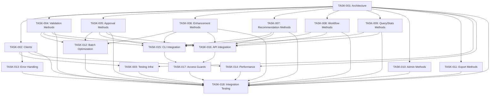

# MCP-First Architecture Migration - Task Cards

This directory contains detailed task cards for the MCP-first architecture migration.

## Task Overview

| Task | Title | Phase | Priority | Effort | Status | Dependencies |
|------|-------|-------|----------|--------|--------|--------------|
| [TASK-001](TASK-001.md) | MCP Server Architecture & Base Infrastructure | Phase 1 | P0 | 3 days | Not Started | None |
| [TASK-002](TASK-002.md) | MCP Client Wrappers (Sync & Async) | Phase 1 | P0 | 2 days | Not Started | TASK-001 |
| [TASK-003](TASK-003.md) | Testing Infrastructure for MCP | Phase 1 | P0 | 3 days | Not Started | TASK-001, TASK-002 |
| [TASK-004](TASK-004.md) | Validation Methods Implementation | Phase 2 | P0 | 4 days | Not Started | TASK-001 |
| [TASK-005](TASK-005.md) | Approval Methods Implementation | Phase 2 | P0 | 1 day | Not Started | TASK-001 |
| [TASK-006](TASK-006.md) | Enhancement Methods Implementation | Phase 2 | P0 | 3 days | Not Started | TASK-001 |
| [TASK-007](TASK-007.md) | Recommendation Methods Implementation | Phase 2 | P0 | 5 days | Not Started | TASK-001 |
| [TASK-008](TASK-008.md) | Workflow Methods Implementation | Phase 2 | P0 | 4 days | Not Started | TASK-001 |
| [TASK-009](TASK-009.md) | Query/Stats Methods Implementation | Phase 2 | P0 | 2 days | Not Started | TASK-001 |
| [TASK-010](TASK-010.md) | Admin/Maintenance Methods Implementation | Phase 2 | P1 | 3 days | Not Started | TASK-001 |
| [TASK-011](TASK-011.md) | Export Methods Implementation | Phase 3 | P1 | 2 days | Not Started | TASK-001 |
| [TASK-012](TASK-012.md) | Batch Operation Optimization | Phase 3 | P1 | 3 days | Not Started | TASK-004, TASK-005, TASK-006 |
| [TASK-013](TASK-013.md) | Error Handling & Retry Logic Enhancement | Phase 3 | P0 | 2 days | Not Started | TASK-002 |
| [TASK-014](TASK-014.md) | Performance Monitoring & Metrics | Phase 3 | P1 | 3 days | Not Started | TASK-001, TASK-002 |
| [TASK-015](TASK-015.md) | CLI Integration (Refactor All Commands) | Phase 4 | P0 | 3 days | Not Started | All Phase 2 |
| [TASK-016](TASK-016.md) | API Integration (Refactor All Endpoints) | Phase 4 | P0 | 4 days | Not Started | All Phase 2 |
| [TASK-017](TASK-017.md) | Access Guards & MCP-Only Enforcement | Phase 5 | P0 | 2 days | Not Started | TASK-015, TASK-016 |
| [TASK-018](TASK-018.md) | Comprehensive Integration Testing & Validation | Phase 5 | P0 | 3 days | Not Started | All tasks |

## Progress Tracking

### Phase 1: Foundation (Week 1-2)
- [ ] TASK-001: MCP Server Architecture (3 days)
- [ ] TASK-002: MCP Client Wrappers (2 days)
- [ ] TASK-003: Testing Infrastructure (3 days)

**Total**: 8 days (2 weeks)

### Phase 2: Core Operations (Week 3-5)
- [ ] TASK-004: Validation Methods (4 days)
- [ ] TASK-005: Approval Methods (1 day)
- [ ] TASK-006: Enhancement Methods (3 days)
- [ ] TASK-007: Recommendation Methods (5 days)
- [ ] TASK-008: Workflow Methods (4 days)
- [ ] TASK-009: Query/Stats Methods (2 days)
- [ ] TASK-010: Admin/Maintenance Methods (3 days)

**Total**: 22 days (3 weeks with parallelization)

### Phase 3: Advanced Operations (Week 6-7)
- [ ] TASK-011: Export Methods (2 days)
- [ ] TASK-012: Batch Optimization (3 days)
- [ ] TASK-013: Error Handling Enhancement (2 days)
- [ ] TASK-014: Performance Monitoring (3 days)

**Total**: 10 days (2 weeks with parallelization)

### Phase 4: Integration (Week 8)
- [ ] TASK-015: CLI Integration (3 days)
- [ ] TASK-016: API Integration (4 days)

**Total**: 7 days (1 week with parallelization)

### Phase 5: Enforcement & Testing (Week 9)
- [ ] TASK-017: Access Guards (2 days)
- [ ] TASK-018: Integration Testing (3 days)

**Total**: 5 days (1 week)

## Task Card Template

All task cards follow the standard template in [TASK_TEMPLATE.md](TASK_TEMPLATE.md).

Each task card includes:
- Metadata (priority, effort, dependencies)
- Clear objective and scope
- Acceptance criteria
- Detailed implementation plan
- Files to create/modify/delete
- Testing requirements (unit, integration, manual)
- Documentation updates
- Runbook with exact commands
- Rollback plan
- Definition of done checklist

## How to Use These Task Cards

### 1. Review Task Card
```bash
# View task details
cat plans/tasks/TASK-001.md
```

### 2. Create Feature Branch
```bash
# Create branch from task ID
git checkout -b feature/task-001-description
```

### 3. Follow Implementation Plan
- Read "Detailed Implementation" section
- Create files as specified
- Modify files as specified
- Follow code examples provided

### 4. Run Tests
```bash
# Run unit tests for this task
pytest tests/path/test_feature.py -v

# Run integration tests
pytest tests/integration/test_feature_integration.py -v
```

### 5. Update Documentation
- Follow "Documentation Updates" section
- Update all specified files
- Add examples as shown

### 6. Follow Runbook
```bash
# Execute runbook commands in order
# (shown in each task card)
```

### 7. Verify Definition of Done
- Check all items in "Definition of Done" section
- Ensure 100% completion before marking done

### 8. Create Pull Request
```bash
# Push changes
git push origin feature/task-XXX-description

# Create PR with:
# - Title: "feat(mcp): [task description] (TASK-XXX)"
# - Description: Link to task card
# - Checklist from Definition of Done
```

## Task Dependencies



## Critical Path

The critical path (longest dependency chain) is:

1. **TASK-001** (3 days) - Foundation architecture
2. **TASK-002** (2 days) - Client wrappers
3. **TASK-004** (4 days) - Validation methods
4. **TASK-007** (5 days) - Recommendation methods
5. **TASK-015** (3 days) - CLI integration
6. **TASK-016** (4 days) - API integration
7. **TASK-017** (2 days) - Access guards
8. **TASK-018** (3 days) - Integration testing

**Total Critical Path**: 26 days (~5.2 weeks)

With parallelization, total timeline is **9 weeks**.

## Parallelization Strategy

### Week 1-2: Foundation (Sequential)
- TASK-001 → TASK-002 → TASK-003

### Week 3-5: Core Operations (Parallel)
- **Track 1**: TASK-004 (Validation) → TASK-007 (Recommendations)
- **Track 2**: TASK-005 (Approval) → TASK-008 (Workflows)
- **Track 3**: TASK-006 (Enhancement) → TASK-009 (Query/Stats)
- **Track 4**: TASK-010 (Admin)

### Week 6-7: Advanced (Parallel)
- **Track 1**: TASK-011 (Export) → TASK-012 (Batch Optimization)
- **Track 2**: TASK-013 (Error Handling) → TASK-014 (Performance)

### Week 8: Integration (Parallel)
- **Track 1**: TASK-015 (CLI)
- **Track 2**: TASK-016 (API)

### Week 9: Final (Sequential)
- TASK-017 (Guards) → TASK-018 (Testing)

## Success Metrics

Track these metrics per task:

- [ ] All acceptance criteria met
- [ ] Test coverage >90%
- [ ] No regressions detected
- [ ] Documentation complete
- [ ] Code reviewed and approved
- [ ] Performance validated (<5ms overhead)

## Communication

### Daily Standup
- What task(s) are you working on?
- What's your progress (%)?
- Any blockers?

### Weekly Review
- Tasks completed this week
- Tasks in progress
- Tasks blocked
- Risks and mitigations
- Next week's plan

### Phase Gates
Before moving to next phase:
- [ ] All phase tasks 100% complete
- [ ] Integration tests passing
- [ ] Performance benchmarks met
- [ ] Documentation updated
- [ ] No critical bugs
- [ ] Approval from tech lead

---

**Last Updated**: 2025-11-30
**Status**: Planning Complete, Ready to Execute
