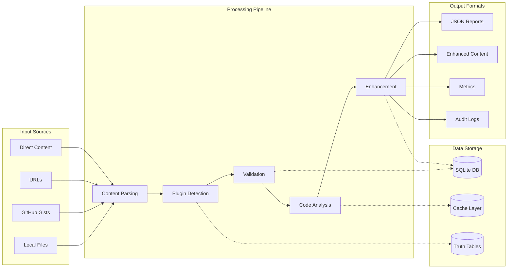
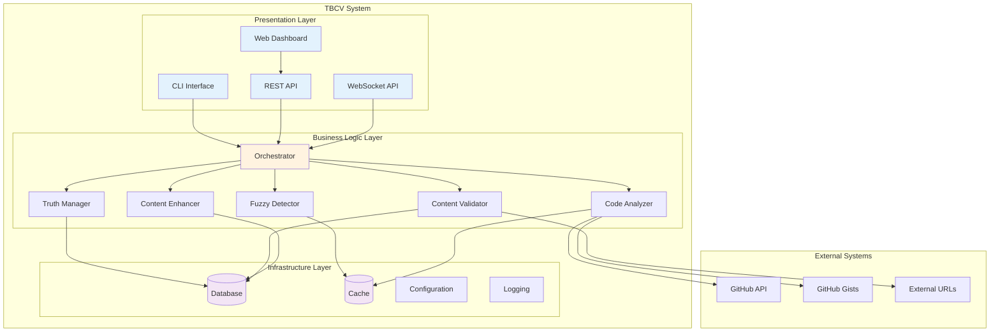
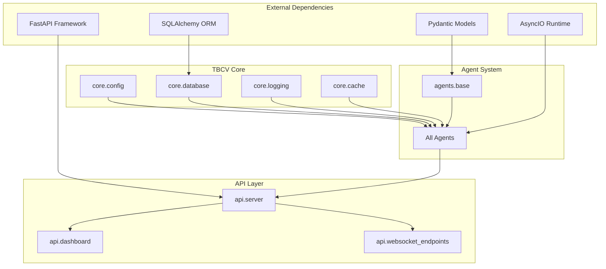

Here’s a cleaned, properly formatted version—same content, clearer structure and readable Markdown.

````md
# TBCV System Architecture

| **Title** | System Architecture |
|---|---|
| **Version** | auto |
| **Source** | Code analysis @ 2025-11-03T07:43:18Z |

## Overview

TBCV employs a multi-agent architecture where specialized agents collaborate through the Model Context Protocol (MCP) to process, validate, and enhance content. The system is designed around event-driven processing with clear separation of concerns.

## Core Components

### Agent Layer

The heart of TBCV consists of specialized agents, each with distinct responsibilities:

#### 1) TruthManagerAgent (`agents/truth_manager.py:41-686`)
**Responsibility:** Plugin truth data management and indexing  
**Key Classes:** `PluginInfo`, `CombinationRule`, `TruthDataIndex`  
**Primary Functions:**
- Load and index plugin definitions from JSON truth tables
- B-tree indexing for O(log n) plugin lookups
- SHA-256 versioning for change detection
- Pattern compilation and caching

#### 2) FuzzyDetectorAgent (`agents/fuzzy_detector.py:34-196`)
**Responsibility:** Intelligent plugin detection using fuzzy algorithms  
**Key Classes:** `PluginDetection`, `FuzzyDetectorAgent`  
**Primary Functions:**
- Multi-algorithm fuzzy matching (Levenshtein, Jaro-Winkler, Ratio)
- Context-aware detection with configurable windows
- Confidence scoring with combination rules

#### 3) ContentValidatorAgent (`agents/content_validator.py:42-496`)
**Responsibility:** Comprehensive content quality validation  
**Key Classes:** `ValidationIssue`, `ValidationResult`, `ContentValidatorAgent`  
**Primary Functions:**
- YAML frontmatter validation with field classification
- Markdown structure analysis and heading hierarchy
- Code quality checks for multiple languages
- Link validation with timeout handling

#### 4) ContentEnhancerAgent (`agents/content_enhancer.py:28-439`)
**Responsibility:** Intelligent content enhancement and plugin linking  
**Key Classes:** `Enhancement`, `EnhancementResult`, `ContentEnhancerAgent`  
**Primary Functions:**
- First-occurrence plugin linking to prevent over-linking
- Configurable link templates and information text
- AST-based content modification
- Format fixing (headings, code blocks, lists)

#### 5) CodeAnalyzerAgent (`agents/code_analyzer.py:37-1020`)
**Responsibility:** Advanced code analysis with document processing flow understanding  
**Key Classes:** `CodeIssue`, `CodeFix`, `CodeAnalyzerAgent`  
**Primary Functions:**
- Document flow analysis for Aspose patterns
- AST-based code extraction and analysis
- External code integration (GitHub gists, repositories)
- Security analysis and vulnerability detection
- Performance analysis and anti-pattern identification

#### 6) OrchestratorAgent (`agents/orchestrator.py:28-356`)
**Responsibility:** Complex workflow coordination and management  
**Key Classes:** `WorkflowResult`, `OrchestratorAgent`  
**Primary Functions:**
- Dependency-based step execution
- Workflow state management with persistence
- Retry logic with exponential backoff
- Multi-agent coordination

### API Layer

#### FastAPI Server (`api/server.py:1-1012`)
**Responsibility:** Primary REST API interface  
**Key Components:**
- Content validation endpoints
- Batch processing endpoints
- Enhancement and recommendation workflows
- Health checking and monitoring

#### Dashboard Interface (`api/dashboard.py`)
**Responsibility:** Web-based management interface  
**Features:**
- Validation result visualization
- Workflow monitoring and control
- Recommendation approval workflows
- Audit log viewing

#### WebSocket Endpoints (`api/websocket_endpoints.py`)
**Responsibility:** Real-time communication  
**Features:**
- Live progress updates
- Real-time validation results
- Workflow status broadcasting

#### Export Services (`api/export_endpoints.py`)
**Responsibility:** Data export and reporting  
**Features:**
- CSV/JSON export of validation results
- Report generation
- Metrics aggregation

### Core Infrastructure

#### Database Management (`core/database.py:1-800`)
**Responsibility:** Data persistence and state management  
**Key Classes:** `DatabaseManager`, `WorkflowState`, `RecommendationStatus`  
**Features:**
- SQLite database with SQLAlchemy ORM
- Workflow state tracking
- Validation result storage
- Audit logging

#### Configuration System (`core/config.py`)
**Responsibility:** Application configuration management  
**Features:**
- Environment-based configuration
- Validation rule loading
- Plugin pattern management

#### Caching Layer (`core/cache.py`)
**Responsibility:** Two-level caching system  
**Features:**
- L1 in-memory cache for frequent lookups
- L2 persistent cache for expensive operations
- Cache invalidation strategies

#### Logging System (`core/logging.py`)
**Responsibility:** Structured logging and monitoring  
**Features:**
- Configurable log levels
- Structured JSON logging
- Performance metrics collection

### CLI Interface

#### Command Line Tool (`cli/main.py`)
**Responsibility:** Direct command-line access to system features  
**Features:**
- File and directory validation
- Batch processing commands
- Configuration management

## System Interactions

### Agent Communication Flow

```mermaid
graph TD
    A[Content Input] --> B[TruthManagerAgent]
    B --> C[FuzzyDetectorAgent]
    C --> D[ContentValidatorAgent]
    D --> E[CodeAnalyzerAgent]
    E --> F[ContentEnhancerAgent]
    F --> G[OrchestratorAgent]

    B -.-> H[(Truth Database)]
    C -.-> I[(Plugin Patterns)]
    D -.-> J[(Validation Rules)]
    E -.-> K[(External Code)]
    F -.-> L[(Enhancement Templates)]
    G -.-> M[(Workflow State)]

    G --> N[Enhanced Content]
    G --> O[Validation Report]
    G --> P[Metrics & Logs]

    style A fill:#e1f5fe
    style N fill:#e8f5e8
    style O fill:#e8f5e8
    style P fill:#e8f5e8
````

### API Request Flow

```mermaid
sequenceDiagram
    participant C as Client
    participant API as FastAPI Server
    participant O as OrchestratorAgent
    participant A as Agent Pool
    participant DB as Database

    C->>API: POST /validate/content
    API->>O: initiate_workflow()
    O->>DB: save_workflow_state()

    loop Agent Processing
        O->>A: process_step()
        A->>A: execute_analysis()
        A->>O: return_results()
        O->>DB: update_progress()
    end

    O->>API: workflow_complete()
    API->>DB: save_results()
    API->>C: JSON Response
```

### Data Flow Architecture



### Container Architecture



## Module Dependencies

### Core Dependencies



## Scaling and Performance

### Concurrency Model

* **Async/Await:** All I/O operations use asyncio for non-blocking execution
* **Background Tasks:** FastAPI background tasks for long-running operations
* **Worker Pools:** Configurable worker counts for batch processing
* **Queue Management:** SQLite-based job queues for reliable processing

### Caching Strategy

* **L1 Cache:** In-memory LRU cache for frequent plugin lookups
* **L2 Cache:** Persistent SQLite cache for expensive computations
* **Cache Invalidation:** SHA-256 based versioning for truth table updates
* **Batch Operations:** Grouped cache operations to minimize database hits

### Performance Optimizations

* **B-tree Indexing:** O(log n) plugin lookups in `TruthManagerAgent`
* **Pattern Compilation:** Pre-compiled regex patterns for fuzzy detection
* **Batch Processing:** Vector operations for multiple content items
* **Connection Pooling:** SQLAlchemy connection pools for database efficiency

---

For implementation details, see:

* **[Process Flows](process-flows.md)** — detailed workflow sequences
* **[Component Details](components.md)** — individual module APIs
* **[Data Management](dataflow.md)** — data schemas and persistence