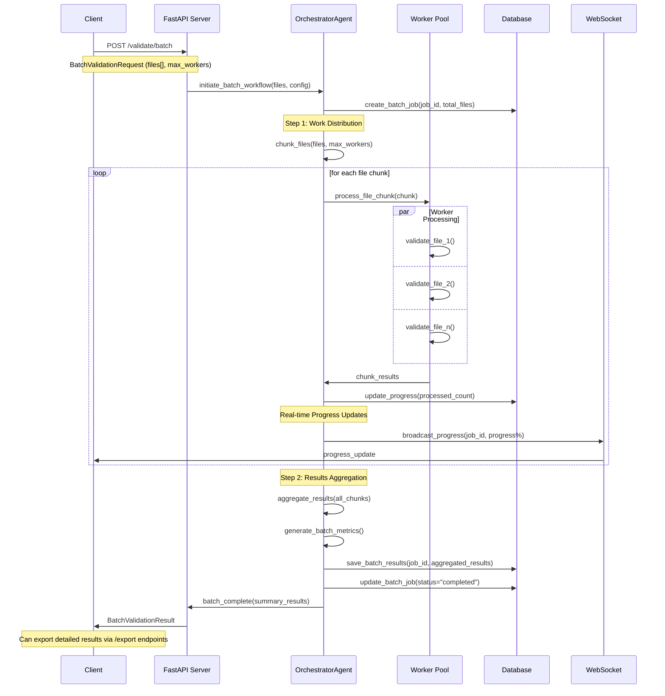
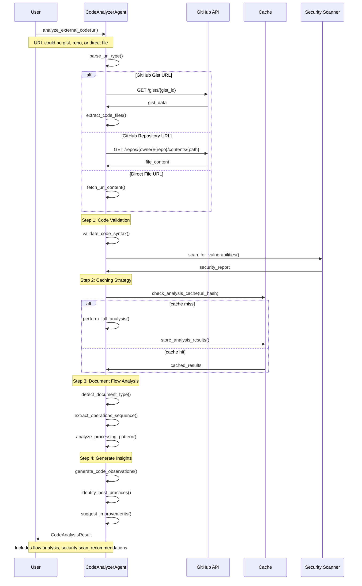
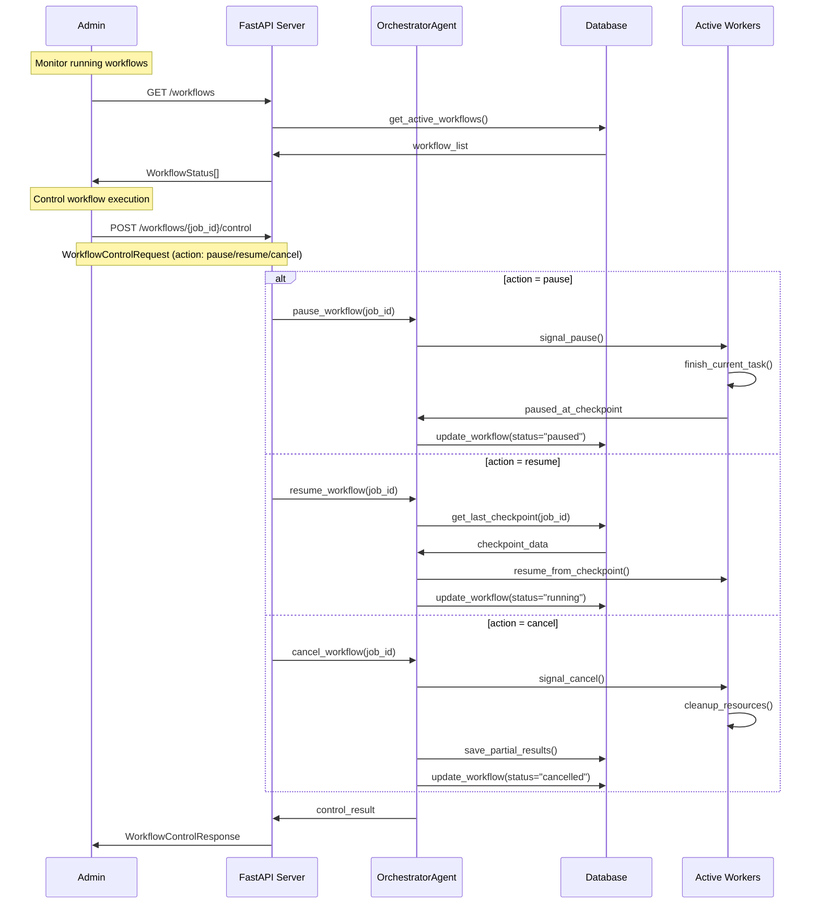
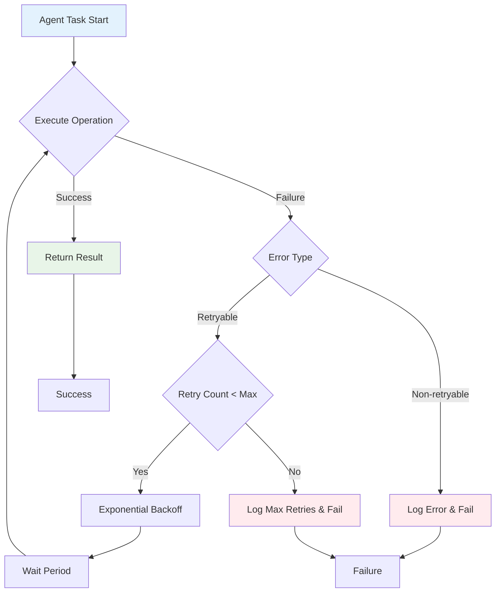
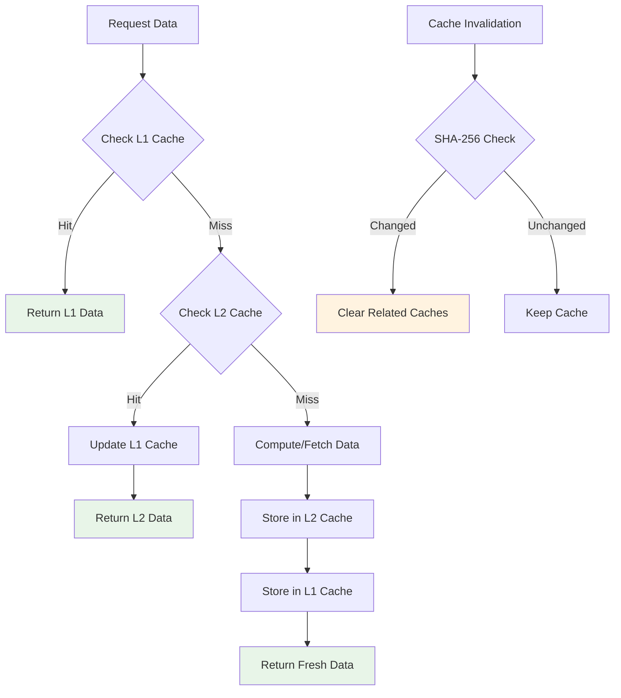
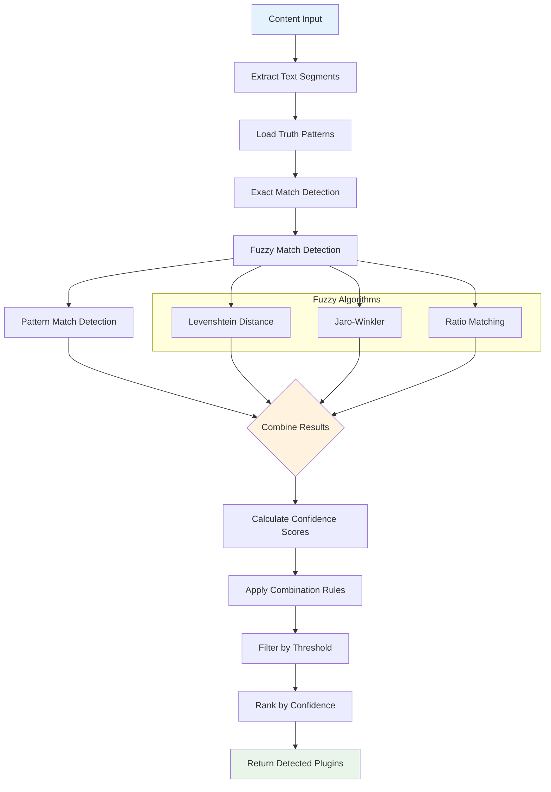

# TBCV Process Flows

| **Title** | Process Flows |
|---|---|
| **Version** | auto |
| **Source** | Code analysis @ 2025-11-03T07:43:18Z |

## Overview

TBCV operates through well-defined process flows that coordinate multiple agents to achieve comprehensive content validation and enhancement. This document details the sequence diagrams and workflow patterns for the major system operations.

## Core Process Flows

### 1. Content Validation Workflow

The primary validation workflow processes content through multiple specialized agents to produce comprehensive quality assessments.

```mermaid
sequenceDiagram
    participant Client
    participant API as FastAPI Server
    participant Orch as OrchestratorAgent
    participant TM as TruthManagerAgent
    participant FD as FuzzyDetectorAgent
    participant CV as ContentValidatorAgent
    participant CA as CodeAnalyzerAgent
    participant DB as Database

    Client->>API: POST /validate/content
    Note over Client,API: ContentValidationRequest

    API->>Orch: initiate_workflow(content, config)
    Orch->>DB: create_workflow(job_id, status="running")

    Note over Orch: Step 1: Truth Data Loading
    Orch->>TM: load_truth_data(family="words")
    TM->>TM: index_plugins() # B-tree indexing
    TM->>Orch: truth_data_ready

    Note over Orch: Step 2: Plugin Detection
    Orch->>FD: detect_plugins(content, truth_data)
    FD->>FD: fuzzy_match_text() # Multiple algorithms
    FD->>FD: calculate_confidence() # Weighted scoring
    FD->>Orch: detected_plugins[]

    Note over Orch: Step 3: Content Validation
    Orch->>CV: validate_content(content, plugins)
    CV->>CV: validate_yaml() # Frontmatter check
    CV->>CV: validate_markdown() # Structure analysis
    CV->>CV: validate_links() # URL accessibility
    CV->>Orch: validation_results

    Note over Orch: Step 4: Code Analysis (if applicable)
    alt content contains code
        Orch->>CA: analyze_code(code_blocks)
        CA->>CA: extract_ast() # Abstract syntax tree
        CA->>CA: analyze_document_flow() # Aspose patterns
        CA->>CA: check_security() # Vulnerability scan
        CA->>Orch: code_analysis_results
    end

    Note over Orch: Step 5: Results Aggregation
    Orch->>DB: save_validation_results(job_id, results)
    Orch->>DB: update_workflow(job_id, status="completed")
    Orch->>API: workflow_complete(results)

    API->>Client: 200 OK + ValidationReport
    Note over Client,API: JSON with issues, metrics, recommendations
````

### 2. Content Enhancement Workflow

The enhancement workflow builds upon validation results to automatically improve content quality and add intelligent plugin linking.

```mermaid
sequenceDiagram
    participant Client
    participant API as FastAPI Server
    participant Orch as OrchestratorAgent
    participant CE as ContentEnhancerAgent
    participant DB as Database
    participant Cache

    Client->>API: POST /enhance/content
    Note over Client,API: EnhanceContentRequest (validation_id)

    API->>DB: get_validation_results(validation_id)
    DB->>API: validation_data

    API->>Orch: initiate_enhancement(validation_data)
    Orch->>DB: create_workflow(job_id, status="enhancing")

    Note over Orch: Step 1: Validation Data Analysis
    Orch->>CE: analyze_validation_results(validation_data)
    CE->>CE: identify_enhancement_opportunities()
    CE->>CE: prioritize_recommendations()
    CE->>Orch: enhancement_plan

    Note over Orch: Step 2: Plugin Linking
    Orch->>CE: add_plugin_links(content, detected_plugins)
    CE->>CE: find_first_occurrence() # Prevent over-linking
    CE->>Cache: get_link_template(plugin_id)
    CE->>CE: generate_markdown_links()
    CE->>Orch: linked_content

    Note over Orch: Step 3: Information Enhancement
    Orch->>CE: add_info_text(content, context)
    CE->>CE: generate_contextual_info() # Based on plugin usage
    CE->>CE: insert_at_optimal_position()
    CE->>Orch: enhanced_content

    Note over Orch: Step 4: Format Fixes
    Orch->>CE: apply_format_fixes(content)
    CE->>CE: fix_heading_hierarchy()
    CE->>CE: normalize_code_blocks()
    CE->>CE: standardize_lists()
    CE->>Orch: formatted_content

    Note over Orch: Step 5: Quality Verification
    Orch->>CE: verify_enhancements(original, enhanced)
    CE->>CE: check_link_validity()
    CE->>CE: validate_markdown_syntax()
    CE->>Orch: verification_results

    alt preview mode
        Orch->>API: return_preview(enhanced_content, changes)
        API->>Client: EnhancementPreview
    else apply mode
        Orch->>DB: save_enhanced_content(job_id, content)
        Orch->>DB: update_workflow(status="completed")
        API->>Client: EnhancementResult
    end
```

### 3. Batch Processing Workflow

For handling multiple files efficiently with parallel processing and progress tracking.



### 4. External Code Integration Workflow

For fetching and analyzing code from external sources like GitHub gists and repositories.



### 5. Workflow Management and Control

For managing long-running workflows with pause, resume, and cancellation capabilities.



## Specialized Processing Patterns

### Error Handling and Retry Logic



### Cache Management Flow



### Plugin Detection Algorithm



## Performance Characteristics

### Scalability Patterns

* **Horizontal Scaling:** Worker pool size configurable per workflow type
* **Vertical Scaling:** Memory and CPU intensive operations use background tasks
* **Cache Optimization:** Two-level cache reduces repeated computations by 70–90%
* **Database Efficiency:** Connection pooling and prepared statements

### Throughput Metrics

* **Single File Validation:** ~200–500 ms (depending on content size and complexity)
* **Batch Processing:** ~50–100 files per minute (with 4 workers)
* **Plugin Detection:** ~10–50 ms per content segment
* **Code Analysis:** ~1–5 s per code block (including external fetching)

### Resource Usage

* **Memory:** ~50–200 MB baseline + ~10 MB per active workflow
* **Storage:** SQLite database grows ~1–5 MB per 1000 validation results
* **Network:** External code fetching limited to 10 MB per file
* **CPU:** Agent processing is I/O bound, scales well with async operations

---

For implementation guidance, see:

* **[Architecture Overview](architecture.md)** — Component relationships
* **[Component Details](components.md)** — Individual module APIs
* **[Operations Guide](operations.md)** — Running and monitoring workflows